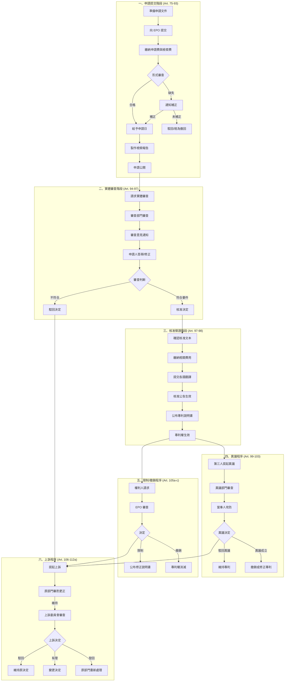

# 🇪🇺 歐盟專利申請程序流程總覽

**依據文件**：European Patent Convention (EPC) - 2025年4月1日版本

---

## 📊 程序階段總覽

```
┌─────────────────────────────────────────────────────────────────────────┐
│                      歐盟專利申請生命週期                                  │
├─────────────────────────────────────────────────────────────────────────┤
│                                                                         │
│  【階段一】              【階段二】              【階段三】               │
│   申請提交 ──────────────▶ 實體審查 ──────────────▶ 核准領證              │
│   Filing Phase           Examination Phase       Grant Phase           │
│   (Art. 75-93)           (Art. 94-97)            (Art. 97-98)          │
│                                                                         │
│        │                      │                       │                 │
│        ▼                      ▼                       ▼                 │
│   ┌─────────┐           ┌─────────┐            ┌──────────┐            │
│   │形式缺失 │           │  駁回   │            │  異議    │            │
│   │補正程序 │           │         │            │  程序    │            │
│   │Art.90(4)│           │Art.97(2)│            │Art.99-103│            │
│   └─────────┘           └────┬────┘            └────┬─────┘            │
│                              │                      │                  │
│                              ▼                      ▼                  │
│                        ┌─────────┐           ┌───────────┐            │
│                        │  上訴   │           │限制/撤銷  │            │
│                        │  程序   │◀──────────│  程序     │            │
│                        │Art.106- │           │Art.105a-c │            │
│                        │   112a  │           └───────────┘            │
│                        └─────────┘                                     │
└─────────────────────────────────────────────────────────────────────────┘
```

---

# 一、申請提交階段（Filing Phase）

## 📋 法規依據
**Art. 75–93 EPC**

## 🔄 流程圖

```
開始申請
    │
    ▼
┌───────────────────────────────────────┐
│ 1. 確認申請人資格 (Art. 58-59)         │
│    • 自然人或法人均可申請               │
│    • 可多人共同申請                     │
└───────────────────────────────────────┘
    │
    ▼
┌───────────────────────────────────────┐
│ 2. 準備申請文件 (Art. 78)              │
│    ├─ (a) 請求書 Request for grant    │
│    ├─ (b) 說明書 Description          │
│    ├─ (c) 請求項 Claims               │
│    ├─ (d) 圖式 Drawings（如有）        │
│    └─ (e) 摘要 Abstract               │
└───────────────────────────────────────┘
    │
    ▼
┌───────────────────────────────────────┐
│ 3. 其他必要文件                        │
│    ├─ 發明人指定 (Art. 81)             │
│    ├─ 優先權聲明 (Art. 87-88)（如主張）│
│    └─ 權利來源說明（如申請人非發明人） │
└───────────────────────────────────────┘
    │
    ▼
┌───────────────────────────────────────┐
│ 4. 向 EPO 提交申請 (Art. 75)           │
│    • 可向 EPO 直接提交                  │
│    • 可透過締約國主管機關提交           │
└───────────────────────────────────────┘
    │
    ▼
┌───────────────────────────────────────┐
│ 5. 繳納費用 (Art. 78(2))               │
│    ├─ 申請費 (Filing fee)              │
│    └─ 檢索費 (Search fee)              │
│    ⚠️ 未繳納 → 申請視為撤回            │
└───────────────────────────────────────┘
    │
    ▼
┌───────────────────────────────────────┐
│ 6. EPO 形式審查 (Art. 90)              │
│    • 審查是否符合申請日要件             │
│    • 審查形式要件是否齊備               │
└───────────────────────────────────────┘
    │
    ├──────────────────────────────┐
    ▼                              ▼
┌──────────────┐           ┌──────────────────┐
│ ✅ 形式合格   │           │ ❌ 形式缺失       │
│              │           │                  │
│ 給予申請日    │           │ 通知補正         │
│ (Art. 80)    │           │ (Art. 90(4))     │
└──────────────┘           └──────────────────┘
    │                              │
    │                    ┌─────────┴─────────┐
    │                    ▼                   ▼
    │            ┌─────────────┐    ┌─────────────┐
    │            │ 期限內補正   │    │ 未補正      │
    │            │ → 繼續程序   │    │ → 駁回/撤回 │
    │            │             │    │ (Art.90(5)) │
    │            └─────────────┘    └─────────────┘
    │                    │
    ▼◀───────────────────┘
┌───────────────────────────────────────┐
│ 7. EPO 製作歐洲檢索報告 (Art. 92)      │
│    • 基於請求項進行前案檢索             │
│    • 參考說明書與圖式                   │
└───────────────────────────────────────┘
    │
    ▼
┌───────────────────────────────────────┐
│ 8. 申請案公開 (Art. 93)                │
│    • 申請日起18個月後公開               │
│    • 或依申請人請求提前公開             │
└───────────────────────────────────────┘
    │
    ▼
【進入實體審查階段】
```

## 📝 重要文件要求

| 文件類型 | 法規依據 | 說明 |
|---------|---------|------|
| 請求書 | Art. 78(1)(a) | 授權請求書 |
| 說明書 | Art. 78(1)(b) | 須清楚完整揭露發明 (Art. 83) |
| 請求項 | Art. 78(1)(c) | 須明確簡潔並有說明書支持 (Art. 84) |
| 圖式 | Art. 78(1)(d) | 說明書或請求項引用時須提供 |
| 摘要 | Art. 78(1)(e) | 僅供技術資訊用途 (Art. 85) |
| 發明人指定 | Art. 81 | 須指明發明人及權利來源 |
| 優先權文件 | Art. 87-88 | 主張優先權時須提供 |

## ⚠️ 核心要件（實體審查依據）

| 要件 | 法規依據 | 審查重點 |
|-----|---------|---------|
| 可專利性 | Art. 52 | 技術領域發明、具新穎性、進步性、產業利用性 |
| 排除事項 | Art. 53 | 違反公序良俗、植物/動物品種、治療方法 |
| 新穎性 | Art. 54 | 不屬於先前技術 |
| 進步性 | Art. 56 | 對所屬技術領域具通常知識者非顯而易見 |
| 產業利用性 | Art. 57 | 可於任何產業製造或使用 |
| 單一性 | Art. 82 | 限於單一發明或具單一發明概念之發明群組 |
| 充分揭露 | Art. 83 | 使技術人員能據以實施 |
| 請求項支持 | Art. 84 | 請求項須有說明書支持 |

---

# 二、實體審查階段（Examination Phase）

## 📋 法規依據
**Art. 94–97 EPC**

## 🔄 流程圖

```
收到歐洲檢索報告
    │
    ▼
┌───────────────────────────────────────┐
│ 1. 提出實體審查請求 (Art. 94(1))       │
│    • 須於法定期限內提出                 │
│    • 須繳納審查費                       │
│    ⚠️ 未提出 → 申請視為撤回 (Art.94(2))│
└───────────────────────────────────────┘
    │
    ▼
┌───────────────────────────────────────┐
│ 2. 審查部門進行實體審查 (Art. 94(3))   │
│    審查項目：                           │
│    ├─ 可專利性 (Art. 52-57)            │
│    ├─ 充分揭露 (Art. 83)               │
│    ├─ 請求項明確性與支持 (Art. 84)     │
│    └─ 修正範圍 (Art. 123)              │
└───────────────────────────────────────┘
    │
    ▼
┌───────────────────────────────────────┐
│ 3. 接收審查意見通知 (Art. 94(3))       │
│    • 審查部門邀請申請人提出陳述意見     │
│    • 或進行申請文件修正                 │
└───────────────────────────────────────┘
    │
    ▼
┌───────────────────────────────────────┐
│ 4. 準備答辯文件                        │
│    ├─ 修正後請求項 (Art. 123)          │
│    ├─ 意見陳述書                       │
│    ├─ 修正說明書/圖式（如需）          │
│    └─ 口頭審理準備資料 (Art. 116)      │
└───────────────────────────────────────┘
    │
    ▼
┌───────────────────────────────────────┐
│ 5. 於期限內遞交答辯 (Art. 94(4))       │
│    ⚠️ 未於期限內回覆 → 申請視為撤回    │
└───────────────────────────────────────┘
    │
    ▼
┌───────────────────────────────────────┐
│ 6. 審查部門判斷                        │
└───────────────────────────────────────┘
    │
    ├────────────────────────────────────────────┐
    ▼                                            ▼
┌──────────────────────────┐        ┌──────────────────────────┐
│ ✅ 符合專利要件           │        │ ❌ 不符合專利要件        │
│                          │        │                          │
│ 核准決定 (Art. 97(1))    │        │ 駁回決定 (Art. 97(2))    │
│                          │        │                          │
│ 進入【核准領證階段】      │        │ 可提起【上訴程序】       │
│                          │        │ (Art. 106-108)           │
└──────────────────────────┘        └──────────────────────────┘
```

## 📝 修正限制 (Art. 123)

| 修正類型 | 限制條件 |
|---------|---------|
| 申請階段修正 | 不得超出原申請內容範圍 (Art. 123(2)) |
| 核准後修正 | 不得擴大保護範圍 (Art. 123(3)) |

## 🎤 口頭審理 (Art. 116)

- EPO 認為有必要時得傳喚口頭審理
- 當事人亦得請求口頭審理
- 審查部門口頭審理不公開 (Art. 116(3))

---

# 三、核准領證階段（Grant & Issuance Phase）

## 📋 法規依據
**Art. 97–98, 65 EPC**

## 🔄 流程圖

```
收到核准意向通知
    │
    ▼
┌───────────────────────────────────────┐
│ 1. 確認核准文本                        │
│    • 確認請求項最終版本                 │
│    • 與客戶進行權利範圍確認             │
└───────────────────────────────────────┘
    │
    ▼
┌───────────────────────────────────────┐
│ 2. 繳納核准相關費用                    │
│    • 依實施細則規定繳納                 │
│    • 包含公告費用                       │
└───────────────────────────────────────┘
    │
    ▼
┌───────────────────────────────────────┐
│ 3. 各指定國翻譯文件 (Art. 65)          │
│    • 締約國得要求提供官方語言翻譯       │
│    • 須於核准公告後3個月內提交          │
│    ⚠️ 未提交 → 該國專利視為自始無效     │
└───────────────────────────────────────┘
    │
    ▼
┌───────────────────────────────────────┐
│ 4. 核准決定生效 (Art. 97(3))           │
│    • 以歐洲專利公報公告日為生效日       │
└───────────────────────────────────────┘
    │
    ▼
┌───────────────────────────────────────┐
│ 5. 公布專利說明書 (Art. 98)            │
│    • EPO 於核准公告後公布專利說明書     │
└───────────────────────────────────────┘
    │
    ▼
┌───────────────────────────────────────┐
│ 6. 建立專利維護管理                    │
│    • 年費管理 (Art. 86)                │
│    • 專利期限：申請日起20年 (Art. 63)  │
└───────────────────────────────────────┘
    │
    ▼
【專利權生效】
    │
    ├─────────────────────────────────────────────────┐
    ▼                         ▼                       ▼
┌─────────────┐      ┌─────────────────┐     ┌─────────────────┐
│ 第三人異議   │      │ 權利人主動限制   │     │ 對決定不服      │
│             │      │ 或撤銷          │     │                 │
│【異議程序】  │      │【限制/撤銷程序】 │     │【上訴程序】     │
│Art. 99-103  │      │Art. 105a-105c   │     │Art. 106-112a    │
└─────────────┘      └─────────────────┘     └─────────────────┘
```

## 📝 專利權效力 (Art. 64)

| 效力內容 | 說明 |
|---------|------|
| 生效日 | 歐洲專利公報公告日 (Art. 64(1)) |
| 效力範圍 | 各指定締約國 |
| 權利內容 | 等同於各締約國國內專利 |
| 方法專利 | 保護延伸至直接產品 (Art. 64(2)) |
| 侵權處理 | 依各國國內法處理 (Art. 64(3)) |

## 📝 專利期限 (Art. 63)

| 項目 | 內容 |
|-----|------|
| 基本期限 | 申請日起20年 |
| 延長可能 | 締約國得依國內法延長（如藥品上市許可延遲） |

---

# 四、異議程序（Opposition Procedure）

## 📋 法規依據
**Art. 99–105 EPC**

## 🔄 流程圖

```
專利核准公告
    │
    ▼
┌───────────────────────────────────────┐
│ 異議期限：核准公告日起 9 個月內        │
│ (Art. 99(1))                          │
└───────────────────────────────────────┘
    │
    ▼
┌───────────────────────────────────────┐
│ 1. 第三人提起異議 (Art. 99)            │
│    • 任何人均可提起                     │
│    • 須繳納異議費                       │
│    • 異議效力及於所有締約國 (Art.99(2)) │
└───────────────────────────────────────┘
    │
    ▼
┌───────────────────────────────────────┐
│ 2. 異議理由 (Art. 100)                 │
│    僅限以下理由：                       │
│    ├─ (a) 不符可專利性 (Art. 52-57)    │
│    ├─ (b) 揭露不充分 (Art. 83)         │
│    └─ (c) 超出原申請範圍               │
└───────────────────────────────────────┘
    │
    ▼
┌───────────────────────────────────────┐
│ 3. 異議部門審查 (Art. 101(1))          │
│    • 審查異議是否成立                   │
│    • 邀請當事人陳述意見                 │
└───────────────────────────────────────┘
    │
    ▼
┌───────────────────────────────────────┐
│ 4. 專利權人答辯                        │
│    • 提交答辯書                         │
│    • 得提出修正文本                     │
│    • 參與口頭審理（如有）               │
└───────────────────────────────────────┘
    │
    ▼
┌───────────────────────────────────────┐
│ 5. 異議部門決定 (Art. 101(2)(3))       │
└───────────────────────────────────────┘
    │
    ├─────────────────────────────────────────────────┐
    ▼                         ▼                       ▼
┌─────────────┐      ┌─────────────────┐     ┌─────────────────┐
│ 駁回異議     │      │ 維持專利        │     │ 撤銷專利        │
│             │      │ （經修正）       │     │                 │
│ 專利維持     │      │ 公布新說明書     │     │ 專利失效        │
│ 原狀        │      │ (Art. 103)      │     │ (Art. 101(2))   │
└─────────────┘      └─────────────────┘     └─────────────────┘
                              │                       │
                              ▼                       ▼
                     【任一方得提起上訴】    【任一方得提起上訴】
```

## 📝 異議介入 (Art. 105)

| 情況 | 說明 |
|-----|------|
| 介入時機 | 異議期限屆滿後 |
| 介入資格 | 被控侵權人或提起不侵權確認訴訟者 |
| 效果 | 視同異議人 |

---

# 五、限制與撤銷程序（Limitation & Revocation Procedure）

## 📋 法規依據
**Art. 105a–105c EPC**

## 🔄 流程圖

```
專利權人發現需修正或撤銷專利
    │
    ▼
┌───────────────────────────────────────┐
│ 前提條件 (Art. 105a(2))                │
│ ⚠️ 異議程序進行中時不得提出            │
└───────────────────────────────────────┘
    │
    ▼
┌───────────────────────────────────────┐
│ 1. 提出限制或撤銷請求 (Art. 105a(1))   │
│    • 由專利權人主動提出                 │
│    • 須繳納限制費或撤銷費               │
└───────────────────────────────────────┘
    │
    ▼
┌───────────────────────────────────────┐
│ 2. EPO 審查請求 (Art. 105b(1))         │
│    • 審查是否符合實施細則要求           │
└───────────────────────────────────────┘
    │
    ├─────────────────────────────────────┐
    ▼                                     ▼
┌──────────────────┐           ┌──────────────────┐
│ ✅ 符合要件       │           │ ❌ 不符合要件    │
│                  │           │                  │
│ 作成限制/撤銷決定 │           │ 駁回請求         │
│ (Art. 105b(2))   │           │ (Art. 105b(2))   │
└──────────────────┘           └──────────────────┘
    │
    ├─────────────────────────┐
    ▼                         ▼
┌──────────────────┐   ┌──────────────────┐
│ 限制決定          │   │ 撤銷決定          │
│                  │   │                  │
│ • 效力及於所有    │   │ • 效力及於所有    │
│   締約國         │   │   締約國         │
│ • 公報公告日生效  │   │ • 公報公告日生效  │
│   (Art.105b(3)) │   │   (Art.105b(3)) │
│                  │   │                  │
│ 公布修正說明書    │   │ 專利權消滅        │
│ (Art. 105c)      │   │                  │
└──────────────────┘   └──────────────────┘
```

---

# 六、上訴程序（Appeal Procedure）

## 📋 法規依據
**Art. 106–112a EPC**

## 🔄 流程圖

```
收到不利決定
（收件部門/審查部門/異議部門/法務部門）
    │
    ▼
┌───────────────────────────────────────┐
│ 1. 評估是否提起上訴 (Art. 107)         │
│    • 受決定不利影響之當事人均得提起     │
│    • 上訴具暫停執行效力 (Art. 106(1))  │
└───────────────────────────────────────┘
    │
    ▼
┌───────────────────────────────────────┐
│ 2. 提交上訴通知 (Art. 108)             │
│    • 期限：決定通知後 2 個月內          │
│    • 須繳納上訴費                       │
│    ⚠️ 未繳費 → 上訴不成立              │
└───────────────────────────────────────┘
    │
    ▼
┌───────────────────────────────────────┐
│ 3. 提交上訴理由書 (Art. 108)           │
│    • 期限：決定通知後 4 個月內          │
└───────────────────────────────────────┘
    │
    ▼
┌───────────────────────────────────────┐
│ 4. 原部門審酌更正 (Art. 109)           │
│    • 認為上訴有理由時得自行更正決定     │
│    • 3個月內未更正 → 移送上訴委員會     │
└───────────────────────────────────────┘
    │
    ├─────────────────┐
    ▼                 ▼
┌──────────────┐  ┌───────────────────────────────┐
│ 原部門更正    │  │ 移送上訴委員會 (Board of Appeal)│
│              │  │                               │
│ 程序終結     │  │ 5. 上訴委員會審查 (Art. 110)   │
└──────────────┘  │    • 審查上訴是否有理由        │
                  └───────────────────────────────┘
                              │
                              ▼
                  ┌───────────────────────────────┐
                  │ 6. 上訴委員會決定 (Art. 111)   │
                  └───────────────────────────────┘
                              │
    ┌─────────────────────────┼─────────────────────────┐
    ▼                         ▼                         ▼
┌──────────────┐      ┌──────────────┐      ┌──────────────────┐
│ 駁回上訴      │      │ 上訴有理     │      │ 發回原部門       │
│              │      │              │      │                  │
│ 維持原決定    │      │ 變更原決定   │      │ 原部門受上訴委員 │
│              │      │              │      │ 會法律見解拘束   │
│              │      │              │      │ (Art. 111(2))    │
└──────────────┘      └──────────────┘      └──────────────────┘
                              │
                              ▼
                  ┌───────────────────────────────┐
                  │ 涉及法律統一或重要法律問題時    │
                  │ → 得提交擴大上訴委員會         │
                  │   (Enlarged Board of Appeal)  │
                  │   (Art. 112)                  │
                  └───────────────────────────────┘
```

## 📝 再審請求 (Art. 112a)

| 項目 | 說明 |
|-----|------|
| 請求對象 | 上訴委員會決定 |
| 請求機關 | 擴大上訴委員會 |
| 請求理由 | 程序瑕疵（成員迴避、程序違法、犯罪行為等） |
| 期限 | 決定通知後2個月內（犯罪行為：確定後2個月內，最長5年） |

---

# 七、共通程序規定

## 📋 法規依據
**Art. 113–125 EPC**

## 📝 重要程序原則

| 原則 | 法規依據 | 說明 |
|-----|---------|------|
| 聽審權 | Art. 113(1) | 決定須基於當事人有機會陳述意見之事實或證據 |
| 依文本審查 | Art. 113(2) | EPO 僅依申請人提交或同意之文本審查 |
| 職權調查 | Art. 114(1) | EPO 得依職權調查事實 |
| 第三人意見 | Art. 115 | 申請公開後，任何人得就可專利性提出意見 |
| 口頭審理 | Art. 116 | EPO 得傳喚或當事人得請求 |

## 📝 期限救濟

| 救濟類型 | 法規依據 | 適用情況 |
|---------|---------|---------|
| 繼續處理 | Art. 121 | 未遵守EPO期限時得請求 |
| 權利回復 | Art. 122 | 已盡注意義務仍無法遵守期限時 |

## 📝 修正限制 (Art. 123)

```
┌─────────────────────────────────────────────────────┐
│                   修正限制原則                        │
├─────────────────────────────────────────────────────┤
│                                                     │
│  【申請階段】                【核准後】              │
│                                                     │
│  Art. 123(2)                 Art. 123(2) + (3)     │
│  ────────────                ─────────────────     │
│  不得超出                     不得超出              │
│  原申請內容                   原申請內容            │
│                              +                      │
│                              不得擴大保護範圍        │
└─────────────────────────────────────────────────────┘
```

---

# 八、階段關係總覽圖



---

## 📚 附錄：法條快速索引

| 程序階段 | 核心條文 |
|---------|---------|
| 申請提交 | Art. 75-93 |
| 可專利性要件 | Art. 52-57 |
| 請求項與說明書 | Art. 82-85 |
| 優先權 | Art. 87-89 |
| 形式審查 | Art. 90 |
| 檢索報告 | Art. 92 |
| 申請公開 | Art. 93 |
| 實體審查 | Art. 94 |
| 核准/駁回 | Art. 97 |
| 專利公布 | Art. 98 |
| 異議程序 | Art. 99-105 |
| 限制/撤銷 | Art. 105a-105c |
| 上訴程序 | Art. 106-112a |
| 共通規定 | Art. 113-125 |
| 修正限制 | Art. 123 |

---

**文件建立日期**：2026年1月7日
**依據版本**：EPC 2025年4月1日版
