# 📘 日本特許法 — 專利申請程序流程總覽

> **文件依據**：特許法（昭和三十四年法律第百二十一号）  
> **結構原則**：依專利申請階段建立程序關係圖

---

## 🗂 程序階段總覽

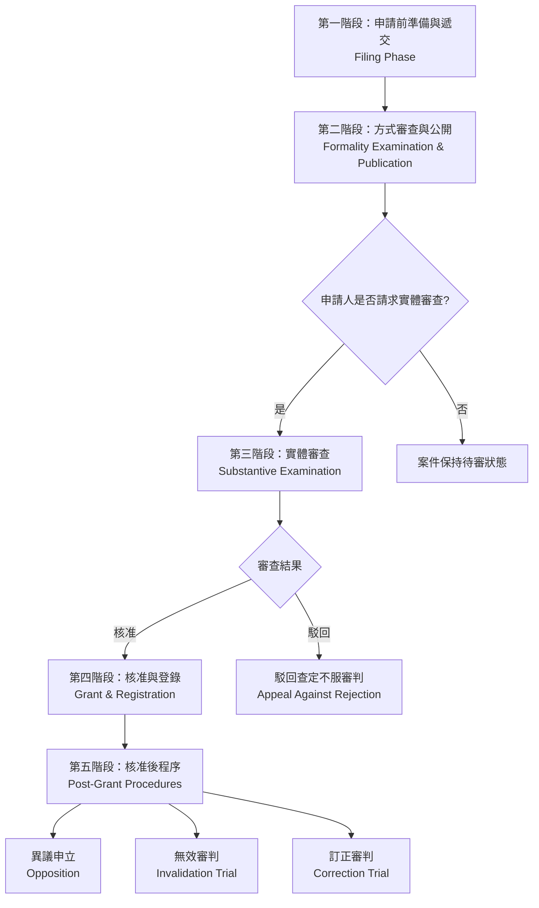

---

# 📋 第一階段：申請前準備與遞交階段
## Filing & Preparation Phase

### 📍 法規依據
- **特許法 第36條**：願書記載事項
- **特許法 第38條**：共同申請原則
- **特許法 第39條**：先願主義

---

### 📄 準備文件清單

#### 1️⃣ 基本申請文件（第36條）

| 文件名稱 | 法條依據 | 說明 |
|---------|---------|------|
| **願書** | 第36條第1項 | 記載申請人、發明人資訊 |
| **明細書** | 第36條第2項 | 發明詳細說明 |
| **特許請求範圍** | 第36條第2項 | 權利範圍界定 |
| **圖式** | 第36條第2項 | 必要時提供 |
| **要約書** | 第36條第2項 | 發明摘要 |

#### 2️⃣ 優先權文件（如主張優先權）

| 文件類型 | 法條依據 | 說明 |
|---------|---------|------|
| **國內優先權聲明** | 第41條 | 前案申請後1年內 |
| **巴黎公約優先權** | 第43條 | 第一國申請後1年內 |
| **優先權證明文件** | 第43條第2項 | 需提交優先權文件 |

#### 3️⃣ 費用繳納

| 費用項目 | 法條依據 | 繳納時點 |
|---------|---------|---------|
| **申請費** | 第195條第2項 | 提出申請時 |
| **審查請求費** | 第195條第2項 | 請求實體審查時 |

---

### ⚙️ 流程步驟

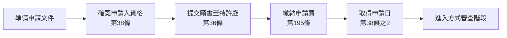

---

### 📌 重要規定與注意事項

#### ▶ 申請人資格（第33條）
- 發明人或承繼人有權申請專利
- 共同發明須共同申請（第38條）

#### ▶ 先願主義（第39條）
- 同一發明有多件申請時，最先申請者取得專利權
- 同日申請時，由申請人協議決定

#### ▶ 單一性要件（第37條）
- 一案一發明原則
- 符合發明單一性之一群發明可列於同一申請案

---

# 📋 第二階段：方式審查與公開階段
## Formality Examination & Publication Phase

### 📍 法規依據
- **特許法 第64條**：出願公開制度
- **特許法 第48條之3**：出願審查請求制度
- **特許法 第17條**：手續補正

---

### ⚙️ 流程步驟

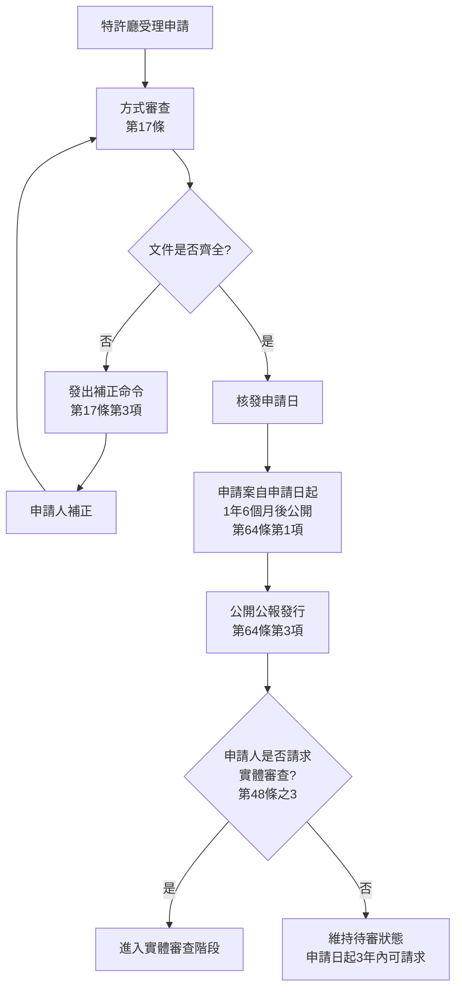

---

### 📌 重要規定與注意事項

#### ▶ 出願公開制度（第64條）

| 項目 | 內容 | 法條 |
|-----|------|------|
| **公開時點** | 申請日起1年6個月 | 第64條第1項 |
| **公開內容** | 願書、明細書、圖式、要約書 | 第64條第2項 |
| **提前公開** | 申請人可請求提前公開 | 第64條之2 |
| **補償金請求權** | 公開後至核准前之實施補償 | 第65條 |

#### ▶ 出願審查請求（第48條之3）

| 項目 | 內容 | 法條 |
|-----|------|------|
| **請求期限** | 申請日起3年內 | 第48條之3第1項 |
| **請求人** | 任何人均可請求 | 第48條之3第1項 |
| **逾期效果** | 申請案視為撤回 | 第48條之3第4項 |
| **不可撤回** | 請求後不得撤回 | 第48條之3第2項 |

#### ▶ 補正權（第17條之2）

```
補正時機：
├─ 收到拒絕理由通知後
├─ 首次拒絕理由通知指定期間內
├─ 第二次拒絕理由通知指定期間內
└─ 提出駁回查定不服審判時
```

---

# 📋 第三階段：實體審查階段
## Substantive Examination Phase

### 📍 法規依據
- **特許法 第48條之7**：先行技術文獻開示制度
- **特許法 第49條**：審查官職權
- **特許法 第50條**：拒絕理由通知
- **特許法 第51條**：核准查定
- **特許法 第52條**：駁回查定

---

### ⚙️ 流程步驟

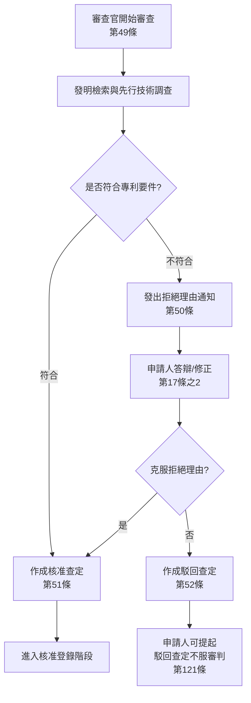

---

### 📌 實體審查判斷基準

#### 1️⃣ 產業利用性（第29條第1項前段）
- 發明必須在產業上可利用

#### 2️⃣ 新穎性（第29條第1項）

```
不具新穎性之情形（第29條第1項各款）：
├─ 公開已知之發明
├─ 公開實施之發明
└─ 刊物已揭示之發明
```

#### 3️⃣ 進步性（第29條第2項）
- 發明對所屬技術領域具通常知識者非顯而易見

#### 4️⃣ 不予專利之發明（第32條）

| 類型 | 說明 |
|-----|------|
| 公序良俗違反 | 有害公共秩序或善良風俗者 |
| 特定方法 | 特定醫療方法等 |

#### 5️⃣ 明細書記載要件（第36條第3項-第6項）

| 要件 | 內容 | 條項 |
|-----|------|------|
| **實施可能性** | 發明可據以實施 | 第36條第4項第1款 |
| **請求範圍支持性** | 權利範圍有明細書支持 | 第36條第6項第1款 |
| **明確性** | 權利範圍界定明確 | 第36條第6項第2款 |

---

### 📄 拒絕理由通知與答辯

#### ▶ 拒絕理由通知（第50條）

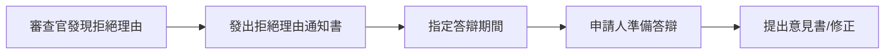

#### ▶ 補正限制（第17條之2第3項-第5項）

**補正三原則**：
1. **範圍限制**：不得超出願書最初記載事項範圍
2. **時機限制**：僅於特定時點可補正
3. **目的限制**：僅限特定補正目的

**允許之補正目的**（第17條之2第5項）：
- 請求項之刪除
- 權利範圍之減縮
- 誤記之訂正
- 不明確記載之釋明

---

### ⚖️ 查定結果分流

#### ✅ 核准查定（第51條）
→ 進入【核准登錄階段】

#### ❌ 駁回查定（第52條）
→ 可提起【駁回查定不服審判】（第121條）

---

# 📋 第四階段：核准與登錄階段
## Grant & Registration Phase

### 📍 法規依據
- **特許法 第66條**：專利權設定登錄
- **特許法 第107條**：特許料繳納
- **特許法 第108條**：登錄期限與專利權發生

---

### ⚙️ 流程步驟

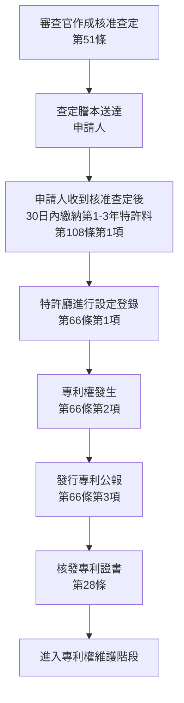

---

### 💰 特許料繳納制度

#### ▶ 第一次繳納（第108條）

| 項目 | 內容 | 說明 |
|-----|------|------|
| **繳納期限** | 核准查定送達後30日內 | 第108條第1項 |
| **繳納年份** | 第1年至第3年 | 第108條第1項 |
| **逾期效果** | 專利權不發生 | 第108條第2項 |

#### ▶ 後續年費（第109條）

| 年份 | 繳納時點 | 法條 |
|-----|---------|------|
| 第4年起 | 前一年度屆滿前 | 第109條第1項 |
| 追納期限 | 繳納期限後6個月內 | 第112條第2項 |
| 未繳效果 | 專利權消滅 | 第112條第4項 |

---

### 📜 專利權內容

#### ▶ 專利權範圍（第68條）
```
專利權效力：
└─ 依專利請求範圍記載內容定之
   └─ 解釋時參考明細書與圖式（第70條）
```

#### ▶ 專利權期限（第67條）

| 項目 | 內容 |
|-----|------|
| **存續期間** | 自申請日起20年 |
| **特殊延長** | 依第67條之2（醫藥品等審查延遲補償） |

---

### 🔄 專利權效力發生與公示

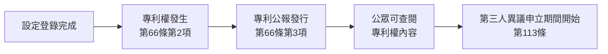

---

# 📋 第五階段：核准後程序
## Post-Grant Procedures

### 📍 程序類型總覽

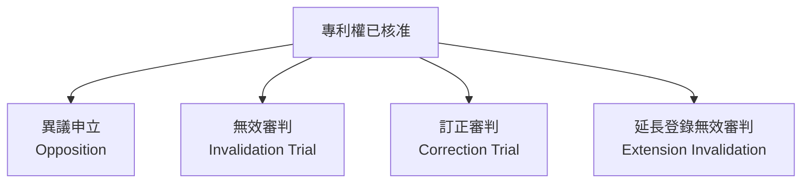

---

## 🔍 5.1 異議申立程序
### Opposition Procedure (第113條-第120條之8)

### 📍 法規依據與目的
- **目的**：提供公眾對已核准專利之異議管道
- **性質**：行政程序（非審判程序）

---

### ⚙️ 流程步驟

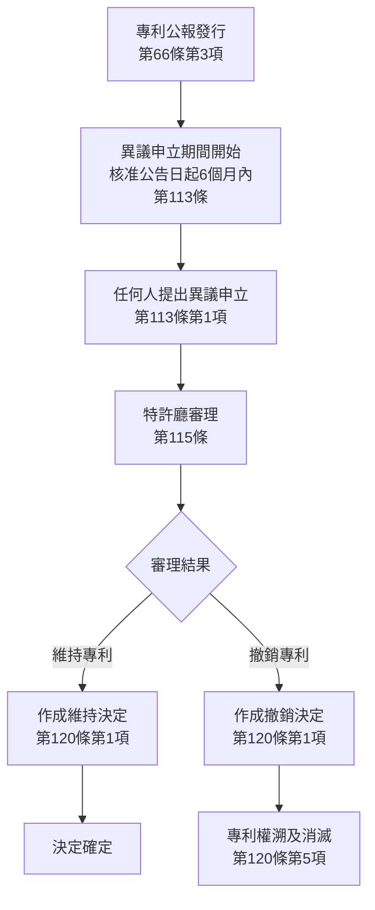

---

### 📄 異議申立要件

#### ▶ 申立人資格（第113條第1項）
- **任何人**均可提出（利害關係非必要）

#### ▶ 申立期間（第113條第1項）
- 專利公報發行日起**6個月內**

#### ▶ 異議理由（第113條）

| 異議理由 | 法條依據 | 說明 |
|---------|---------|------|
| 不具產業利用性 | 第29條第1項前段 | 無法產業利用 |
| 欠缺新穎性 | 第29條第1項 | 申請前已公開 |
| 欠缺進步性 | 第29條第2項 | 易於推知 |
| 不予專利事項 | 第32條 | 違反公序良俗等 |
| 違反記載要件 | 第36條 | 明細書記載不足 |
| 不當分割 | 第44條 | 分割申請不當 |
| 擴大先願 | 第29條之2 | 與先申請衝突 |

---

### 📋 權利人訂正機會

#### ▶ 訂正請求（第120條之5）

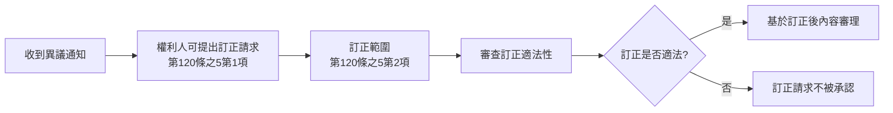

**訂正事項限制**（第120條之5第2項）：
1. 權利範圍之減縮
2. 誤記之訂正
3. 不明確記載之釋明

---

### ⚖️ 決定結果

#### ✅ 維持決定（第120條第1項）
- 異議理由不成立
- 專利權繼續有效

#### ❌ 撤銷決定（第120條第1項）
- 異議理由成立
- 專利權溯及消滅（第120條第5項）

---

## 🔍 5.2 無效審判程序
### Invalidation Trial (第123條-第132條)

### 📍 法規依據與目的
- **目的**：針對不當核准之專利提供救濟管道
- **性質**：準司法程序（審判制度）

---

### ⚙️ 流程步驟

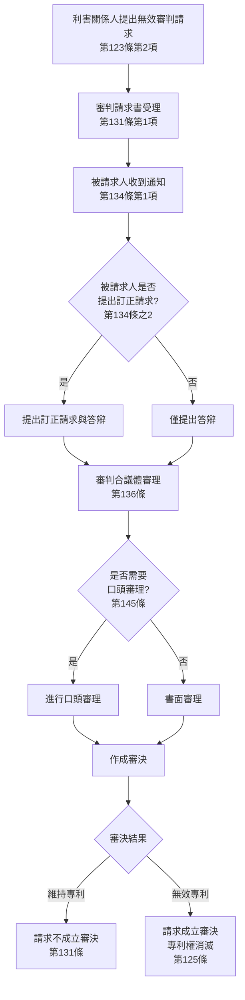

---

### 📄 無效審判要件

#### ▶ 請求人資格（第123條第2項）

| 無效理由類型 | 請求人資格 | 條文 |
|------------|-----------|------|
| 一般無效理由 | **利害關係人** | 第123條第2項 |
| 冒認申請 | **正當權利人** | 第123條第2項但書 |

#### ▶ 請求期間
- **無期間限制**（專利權存續期間內隨時可請求）

#### ▶ 無效理由（第123條第1項）

| 無效理由 | 法條依據 | 說明 |
|---------|---------|------|
| 違反專利要件 | 第29條、第29條之2 | 新穎性、進步性欠缺 |
| 不予專利事項 | 第32條 | 公序良俗違反等 |
| 條約違反 | 第25條 | 外國人權利享有違反 |
| 記載要件違反 | 第36條 | 明細書記載不足 |
| 冒認申請 | 第123條第1項第6號 | 非正當權利人申請 |
| 不當分割/變更 | 第44條、第46條 | 分割/變更不當 |
| 不當修正 | 第126條第7項 | 擴大修正 |

---

### 📋 訂正請求制度（第134條之2）

```
訂正請求時機：
├─ 答辯書提出同時
├─ 審判長指定期間內
└─ 審決前（審判長許可時）
```

**訂正事項**（第134條之2第1項）：
1. 權利範圍之減縮
2. 誤記之訂正
3. 不明確記載之釋明
4. 他請求項引用關係調整

---

### ⚖️ 審決結果與效力

#### ✅ 請求不成立審決（第131條第1項）
- 專利權維持有效
- 不服者可提起審決取消訴訟（第178條）

#### ❌ 請求成立審決（第125條）

```
審決確定效果：
├─ 專利權溯及消滅（自始無效）
├─ 專利權視為自始不存在
└─ 已實施之法律關係不受影響
```

---

### 🔒 一事不再理原則（第167條）

```
相同當事人、相同證據、相同理由：
└─ 不得再次請求無效審判
```

---

## 🔍 5.3 訂正審判程序
### Correction Trial (第126條-第128條)

### 📍 法規依據與目的
- **目的**：專利權人主動修正專利內容
- **時機**：專利權存續期間內隨時可請求

---

### ⚙️ 流程步驟

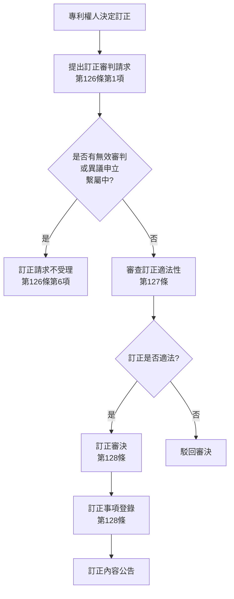

---

### 📄 訂正審判要件

#### ▶ 請求人（第126條第1項）
- 僅限**專利權人**

#### ▶ 訂正事項（第126條第1項）

| 訂正類型 | 說明 | 限制 |
|---------|------|------|
| **權利範圍減縮** | 縮小請求項範圍 | 第126條第6項 |
| **誤記訂正** | 更正明顯錯誤 | - |
| **不明確記載釋明** | 澄清模糊記載 | - |
| **他請求項引用調整** | 調整引用關係 | - |

#### ▶ 訂正限制（第126條第5項-第7項）

```
訂正不得：
├─ 實質擴大或變更權利範圍（第5項）
├─ 超出願書最初記載事項範圍（第5項）
└─ 有無效審判或異議繫屬時請求（第6項）
```

---

### ⚖️ 審決效力

#### ✅ 訂正審決確定（第128條）
```
效果：
├─ 訂正事項登錄於專利原簿
├─ 專利公報公告訂正內容
└─ 訂正後專利內容溯及申請日生效
```

#### ❌ 訂正駁回審決
- 專利內容維持原狀

---

## 🔍 5.4 延長登錄無效審判
### Extension Invalidation Trial (第125條之2)

### 📍 適用情形
- 針對**專利權存續期間延長登錄**之無效請求
- 適用於醫藥品等因法規審查延遲而延長之專利（第67條之2）

---

### ⚙️ 基本流程

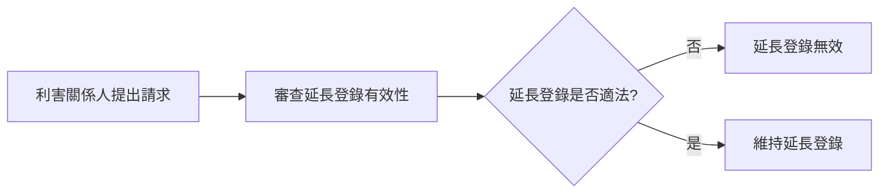

---

# 📋 第六階段：救濟程序
## Appeal & Remedies

### 📍 程序類型

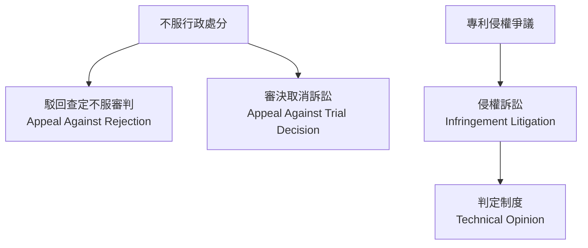

---

## ⚖️ 6.1 駁回查定不服審判
### Appeal Against Rejection (第121條-第122條)

### ⚙️ 流程步驟

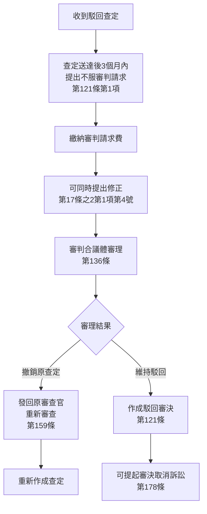

---

### 📄 要件與程序

#### ▶ 請求人資格
- 原申請人

#### ▶ 請求期限（第121條第1項）
- 駁回查定謄本送達後**3個月內**

#### ▶ 審理範圍（第157條）
- 僅就駁回查定所述理由進行審理
- 可發現新拒絕理由時，另行通知

---

## ⚖️ 6.2 審決取消訴訟
### Appeal to Intellectual Property High Court (第178條-第180條)

### ⚙️ 管轄法院
- **知的財產高等裁判所**（智慧財產高等法院）

---

### 📋 訴訟流程

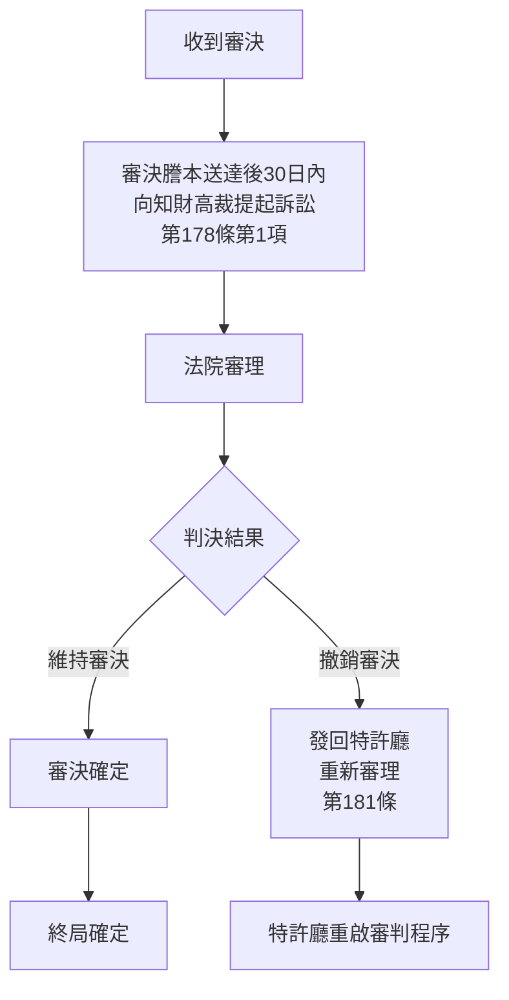

---

### 📄 訴訟要件

#### ▶ 原告適格
- 審判當事人
- 參加人

#### ▶ 提起期限（第178條第1項）
- 審決謄本送達後**30日內**

---

## 🔍 6.3 判定制度
### Technical Opinion System (第71條)

### 📍 制度目的
提供當事人對**技術範圍判定**之行政諮詢

---

### ⚙️ 判定流程

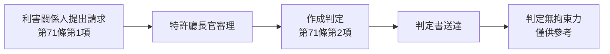

---

### 📄 判定內容

#### ▶ 判定事項
```
判定標的：
└─ 特定產品或方法是否落入專利權範圍
   ├─ 文義解釋比對
   └─ 均等論適用判斷
```

#### ▶ 判定效力
- **無法律拘束力**
- 僅供訴訟或協商參考

---

# 📊 全流程時間軸總覽

```mermaid
gantt
    title 日本專利申請完整時間軸
    dateFormat X
    axisFormat %s
    
    section 申請階段
    申請遞交 :milestone, 0, 0d
    方式審查 :0, 30d
    
    section 公開階段
    申請日起18個月公開 :540d, 1d
    
    section 審查請求
    申請日起3年內請求審查 :0, 1095d
    
    section 實體審查
    審查期間（平均） :1095d, 547d
    
    section 核准登錄
    核准查定 :milestone, 1642, 0d
    30日內繳費 :1642d, 30d
    設定登錄 :milestone, 1672, 0d
    
    section 異議期間
    核准後6個月異議期 :1672d, 180d
```

---

# 📌 重要期限速查表

| 程序 | 期限 | 法條 | 說明 |
|-----|------|------|------|
| **出願審查請求** | 申請日起3年 | 第48條之3 | 逾期申請案視為撤回 |
| **出願公開** | 申請日起1年6個月 | 第64條 | 自動公開 |
| **駁回查定答辯** | 查定送達後60日 | 第50條 | - |
| **核准後繳費** | 核准查定送達後30日 | 第108條 | 逾期專利權不發生 |
| **異議申立** | 核准公告後6個月 | 第113條 | 逾期不得申立 |
| **不服審判請求** | 查定送達後3個月 | 第121條 | - |
| **審決取消訴訟** | 審決送達後30日 | 第178條 | - |
| **年費繳納** | 年度屆滿前 | 第109條 | 追納期6個月 |

---

# 🔚 附註說明

## 📖 文件說明
- 本文件依據《特許法（昭和三十四年法律第百二十一号）》編製
- 流程圖採用 Mermaid 語法繪製
- 所有法條引用依原法條編號標註

## ⚠️ 免責聲明
- 本文件僅供參考，實際程序應依特許廳公告與最新法規為準
- 法規解釋與適用請諮詢專業代理人

## 📅 文件版本
- 建立日期：2026年1月
- 法規版本：特許法（最終改正：令和五年法律第五十三号）

---

**END OF DOCUMENT**
