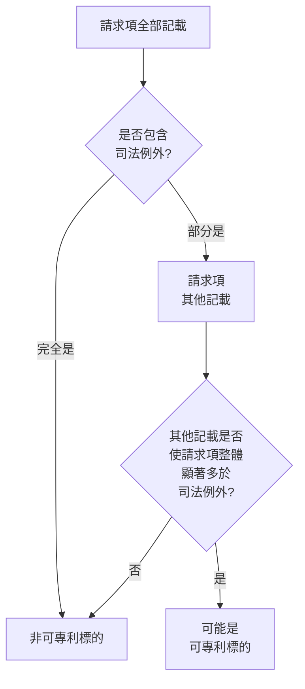
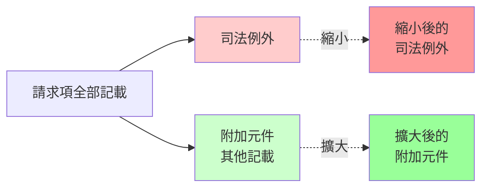
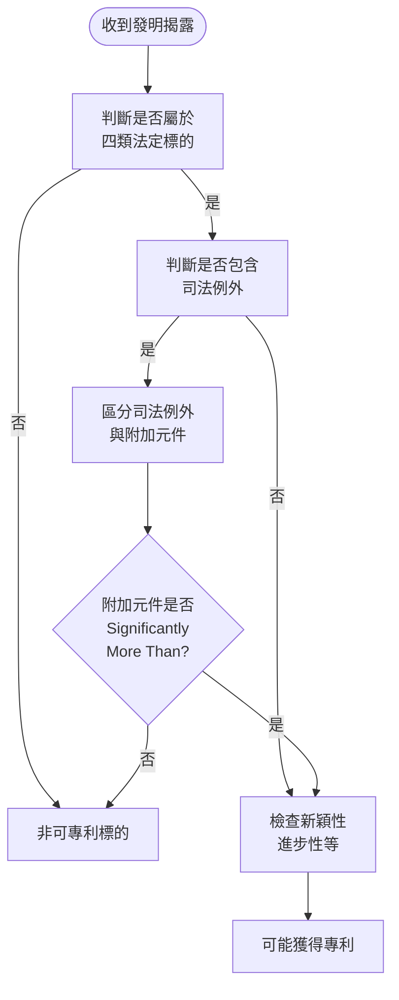
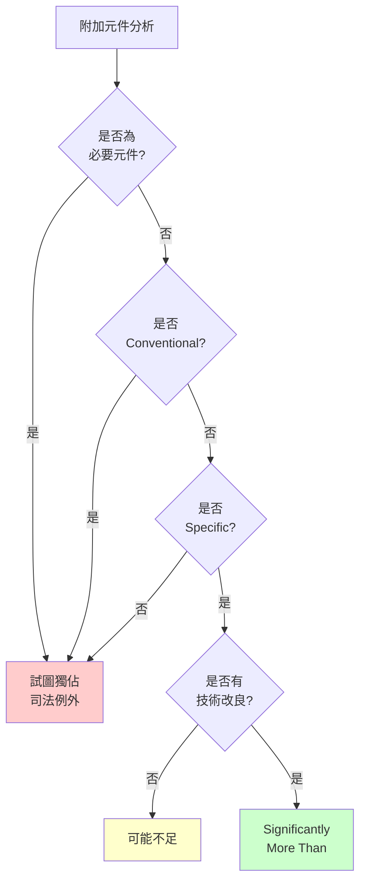
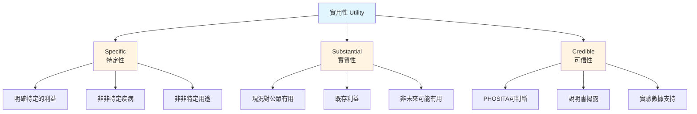
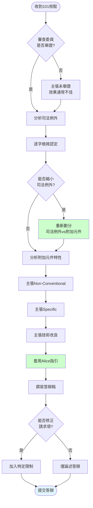

# 美國專利可專利標的(35 U.S.C. §101)及實務

## 課程資訊
- **課程名稱**: US可專利標的35USC101及實務
- **課程類型**: 審查實務
- **講師**: Jamie
- **課程編號**: US05

---

## 主題架構總覽

1. **台灣與中國大陸可專利標的規範回顧**
   - 1.1 發明定義比較
   - 1.2 不予發明專利項目
   - 1.3 產業利用性與實用性要求
   - 1.4 技術思想與技術方案

2. **美國可專利標的法律架構(35 U.S.C. §101)**
   - 2.1 法定可專利標的四類型
   - 2.2 實用性(Utility)三要件
   - 2.3 司法例外(Judicial Exception)

3. **司法例外判斷框架**
   - 3.1 自然法則、自然現象與抽象概念
   - 3.2 兩步驟分析法(Alice/Mayo Framework)
   - 3.3 顯著多於(Significantly More Than)判斷

4. **重要判例分析**
   - 4.1 Benson案(1972)：數值轉換方法
   - 4.2 Flook案(1978)：警報門檻調整方法
   - 4.3 Diehr案(1981)：橡膠硫化製程
   - 4.4 Bilski案(2010)：商業方法與MOT檢驗
   - 4.5 Mayo案(2012)：醫療用藥方法
   - 4.6 Myriad案(2013)：基因隔離
   - 4.7 Alice案(2014)：電子託管系統
   - 4.8 Yu案(2020)：數位相機影像處理

5. **答辯策略與實務建議**
   - 5.1 區分司法例外與附加元件
   - 5.2 主張非常規性(Non-conventional)
   - 5.3 強調特定性(Specific)與技術改良
   - 5.4 避免獨佔抽象概念

---

## 第一章：台灣與中國大陸可專利標的規範回顧

### 1.1 發明定義比較

#### 台灣專利法第21條

**定義**：發明指利用自然法則之技術思想之創作。

**特點**：
- 強調「技術思想」概念
- 必須利用自然界中固有規律(如地心引力)
- 發明分為「物的發明」與「方法的發明」

#### 中國大陸專利法

**定義**：發明指對產品、方法或其改進所提出的新的技術方案。

**特點**：
- 定義相對具體明確
- 強調「技術方案」概念
- 分為「產品發明」與「方法發明」
- 技術方案由若干技術特徵組成

**技術方案架構**：
- **技術特徵**：請求項(Claim)中的各個元件及元件間關係(連接關係、互動關係)
- **技術方案**：多個技術特徵組合,對應一個請求項
- **技術問題**：技術方案所要解決的特定問題
- **技術效果**：解決技術問題後產生的效果

---

### 1.2 不予發明專利項目

#### 台灣專利法第24條

不予發明專利的項目包括:
- 動物及植物
- 人體或動物疾病之診斷、治療或外科手術方法
- 妨害公共秩序或善良風俗者

#### 中國大陸專利法

不予專利項目相對較多,規定於:
- **第5條第1款、第2款**
- **第25條第1款、第2款**

---

### 1.3 產業利用性與實用性要求

#### 台灣產業利用性

**法律依據**：專利法(條號未明確記載於課程中,但屬於專利要件之一)

**要求**：
- 可供產業上利用
- 能在產業上被製造或使用
- 不要求已經實際製造出來

**產業範圍**：
- 工業、農業、林業、漁業、牧業
- 包括商業

**重點**：
- 解決問題的技術手段與產業上有被製造或使用的「可能性」
- 理論上可行但實際上顯然不能製造或使用者,不具產業利用性

**審查基準案例**：
為防止臭氧層減少導致紫外線增加,以吸收紫外線的塑膠膜包覆整個地球表面的方法——理論可行但實際無法實現,不具產業利用性。

#### 中國大陸實用性

**要求更為明確**：
1. **可製造或使用**：與台灣要求接近
2. **積極效果**：必須產生積極和有益的效果
   - 經濟效果
   - 技術效果  
   - 社會效果
   - 必須是可預料的

**積極效果判斷**：
若某發明合成出某種化合物,但該化合物會殺死幾乎所有動物,則不具積極效果,不符合實用性要求。

#### 重要判決：最高行政法院103年度判字案

**案件背景**：
- 申請標的：核酸轉染方法
- 核准後遭舉發,理由為不具產業利用性

**舉發理由**：
1. 申請文件無實際實現數據
2. 實際實驗檢驗無法重現宣稱效果
3. 基因轉質率極低(僅1-4%),毒性高(大於90%),無營業價值

**法院重要見解**：
1. **說明書已揭露製造及利用方法**,即可認定可製造出來
2. **產業利用性重點在於「可能性」**,與是否實際製造或使用無關
3. **不需探究再現性**,不需實驗紀錄或進一步實驗
4. **副作用或毒性不影響產業利用性**,原則上非專利審查重點

**結論**：維持具有產業利用性之判斷。

---

### 1.4 技術思想與技術方案

#### 規格標準與專利

**規格標準本身不可專利**：
- 通訊協定(3G、4G、5G)
- USB接腳定義
- SDXC通訊標準
- 這些為人為制定的規則,非利用自然法則

**實現規格的硬體或軟體可專利**：
實現這些規格標準的具體硬體裝置或軟體方法屬於可專利標的。

#### 檔案格式案例

**技術背景**：
- 某些影音格式的索引檔在錄影完成後才寫入
- 錄影過程:檔頭 → 主體 → 索引檔
- 監視錄影中途斷電會導致索引檔遺失

**發明內容**：
- 利用檔案格式的保留區(Reserved Area)
- 每錄製一段時間(如5或10分鐘),將當前索引資訊寫入保留區
- 斷電後可從保留區資訊恢復檔案

**可專利性**：
- 檔案恢復方法
- 檔案寫入方法
- 檔案讀取方法(讀取保留區)
- 核心在於利用檔案格式保留區創造技術效果
- 台灣、美國專利皆獲准

#### 醫療裝置案例：藥物輸送裝置

**裝置結構**：
- 旋轉組件控制藥物輸送
- 圓柱部分有缺角,與齒輪卡合
- 按壓一次注射固定藥量(如胰島素,可注射7次)

**審查意見**：
智慧財產局認為屬於「注射對人體或動物實施治療」的外科手術方法,為法定不予專利項目(專利法第24條第2款)。

**克服策略**：
1. **刪除相關請求項**(申請人採用的方式)
2. **改變應用場景**：
   - 定量輸送裝置(不限於藥物)
   - 點膠機應用(UV膠黏合)
   - 工業應用中的定量注射需求
3. **重新定義說明書範圍**,避開人體或動物治療用途

**關鍵概念**：
透過整體說明書規劃,有機會避開法定不予專利項目的核駁。

---

## 第二章：美國可專利標的法律架構(35 U.S.C. §101)

### 2.1 法定可專利標的四類型

#### 35 U.S.C. §101 條文

> "Whoever invents or discovers any new and useful process, machine, manufacture, or composition of matter, or any new and useful improvement thereof, may obtain a patent therefor, subject to the conditions and requirements of this title."

**法定四類型**：
1. **Process**(方法)
2. **Machine**(機器)
3. **Manufacture**(製品)
4. **Composition of Matter**(組成物)

#### 最高法院見解(Diamond v. Chakrabarty, 1980)

> "Congress intended statutory subject matter to include anything under the sun that is made by man."

**意涵**：
國會立法意圖是讓「人在太陽底下製造的任何東西」都可獲得專利。

**但須符合**：
- **New**(新穎性)
- **Useful**(實用性)
- 35 U.S.C. 其他條件與要求

---

### 2.2 實用性(Utility)三要件

美國實用性要求三個條件(AND關係)：

#### 1. Specific(特定性)

**定義**：提供明確、特定的利益給公眾。

**不符合特定性案例**：
- 某化合物「能治療非特定疾病」(所有病都能治?)
- 「具有有用的生物性質」但未說明是哪種生物性質或應用
- 「能診斷非特定疾病」但未說明能診斷哪種特定疾病
- 複製DNA可作為診斷工具,但未揭示能診斷哪個特定疾病或任何合適標靶

#### 2. Substantial(實質性)

**定義**：發明現況對公眾有用,具有既存利益(Existing Benefit),而非進一步研究後「未來可能」有用。

**不符合實質性案例**：
- 製造某材料的方法,但材料本身不具實用性(既無specific、substantial也無credible utility)
- 中間產物,但由此產物製成的所有最終產物皆不具實用性
- 主張機器可用於「掩埋」為實用性理由(類似中國大陸的「無積極效果」)

#### 3. Credible(可信性)

**定義**：所屬技術領域中具有通常知識者(PHOSITA)基於說明書揭露及其他證據(實驗數據、專家證詞),可判斷發明所聲稱的實用性是可信的。

**不符合可信性案例**：
- 請求項發明無法操作

#### 特殊案例：含氮碳有機化合物

**問題陳述**：
不能以「有機化合物含有氮與碳元素,因此可作為肥料」為理由主張實用性。

**解釋**(同仁LIZ提供)：
雖然一般有機肥料確實含有氮與碳元素,但並非所有含氮碳的分子都能作為肥料。若說明書僅揭露分子結構而未證明該分子具有其他用途,則不能僅因含氮碳元素就主張必然可作為肥料而具實用性。

---

### 2.3 司法例外(Judicial Exception)

#### 不屬於四類法定標的的項目

美國專利法未明文規定「不予專利項目」,但透過判例建立「司法例外」:

**1. 自然生成物(Products of Nature)**

**2. 印刷物(Printed Matter)**

**基本原則**：
印刷物若不具功能性或結構性關聯,則不具可專利權重。

**案例一：骰子**  
- 請求項：一組有六個表面、具有獨特標記的骰子
- 判斷：獨特標記為印刷物,不具可專利權重
- 結論：標記不納入比對

**案例二：量杯**  
- 請求項：一組標記容量刻度的量杯  
- 判斷：刻度與容器容量有「功能性關聯」
- 結論：刻度具可專利權重,可納入專利性判斷

**2018年CAFC擴大解釋(In re TLI Communications)**：
印刷物原則不僅限於「印刷」的東西,還包括:
- 記載的資訊本身
- 訊息活動

**判斷標準**：
若記載的資訊本身或訊息活動「缺乏與請求項其他元件的功能性關聯」,則視為無功能性的印刷物,在新穎性及進步性判斷上不予可專利權重。

**3. 訊號本身(Signals per se)**

**重要提醒**：
「電腦可讀取記錄媒體」(Computer-Readable Recording Medium)字面範圍包含訊號本身,在美國會被核駁。

**正確寫法**：
「非暫態電腦可讀取記錄媒體」(Non-transitory Computer-Readable Recording Medium),排除訊號本身。

---

## 第三章：司法例外判斷框架

### 3.1 自然法則、自然現象與抽象概念

**來源**：1972年美國聯邦最高法院判決確立四種司法例外

#### 四種司法例外

**1. Laws of Nature(自然法則)**

**案例**：Mayo Collaborative Services v. Prometheus Laboratories, Inc. (2012)
- 請求項涉及藥物新陳代謝後血液中物質濃度測定
- 利用新陳代謝此一自然法則
- 結論：非可專利標的

**2. Natural Phenomena(自然現象)**

**案例**：Association for Molecular Pathology v. Myriad Genetics, Inc. (2013)
- 基因精確位置的發現
- 自然產物
- 結論：分離的DNA(Isolated DNA)為自然產物,非可專利標的
- 但：合成的cDNA不是自然生成,屬可專利標的

**3. Abstract Ideas(抽象概念)**

**案例一**：Bilski v. Kappos (2010)
- 買賣雙方建立避險(對沖)交易的方法
- 商業方法
- 結論：非可專利標的

**案例二**：Alice Corp. v. CLS Bank International (2014)
- 財務交易第三方託管服務
- 抽象概念
- 結論：非可專利標的

**4. Products of Nature(自然產物)**

已於Myriad案中說明。

---

### 3.2 兩步驟分析法(Alice/Mayo Framework)

#### 判斷框架圖示



#### 步驟一：識別司法例外

**判斷**：請求項記載是否屬於或包含司法例外?

**若請求項完全都是司法例外** → 非法定可專利標的

**若請求項部分為司法例外** → 進入步驟二

#### 步驟二：顯著多於判斷

**核心概念**：請求項的「其他記載」是否使請求項整體「顯著多於(Significantly More Than)」司法例外本身?

**判斷重點**：
1. 區分請求項中哪些是「司法例外」,哪些是「其他記載」
2. 分析其他記載是否為:
   - **Well-understood**(已充分理解的)
   - **Routine**(常規的)
   - **Conventional**(慣用的)

**關鍵問題**：
其他記載是否為實現該司法例外的「必要元件」?若是,則傾向認定為試圖獨佔該司法例外。

---

### 3.3 顯著多於(Significantly More Than)判斷

#### 定義

請求項的附加元件(其他記載)必須足以確保該請求項整體:
- 不是「單單只想獨佔該抽象概念」
- 不是「只記載apply it所需的必要元件」
- 不是「試圖以撰寫技巧獨佔抽象概念」

#### Alice案中的判斷標準

**符合Significantly More Than的情況(Maybe)**：

1. **整合成實際應用**  
   整合司法例外成為一個實際應用(Practical Application)的請求項

2. **技術改良**  
   - 對其他科技或技術的改良(Improvement)
   - 對電腦功能本身的改良

3. **應用於特定機器**  
   將司法例外應用在特定機器(Particular Machine)

4. **產生轉換**  
   Effecting a transformation——產生物品不同狀態或東西的轉換

5. **加入特定限制**  
   加入一個特定限制條件,且該限制非該領域中充分理解的(Not Well-Understood)

6. **限於特定有用應用**  
   限定該請求項在一個特定有用的應用

**不符合Significantly More Than的情況**：

1. **高度概括**  
   附加特徵以非常高程度概括方式(High Level of Generality)記載

2. **不顯著的額外動作**  
   增加不顯著的Extra-Solution Activity

3. **一般性指令**  
   一般性地記載「Apply It」

4. **僅記載已知元件**  
   僅記載該領域中充分理解、常規且慣用的活動

5. **僅記載必要元件**  
   僅記載實現司法例外必然會用到的通用電腦或必要步驟

#### Pre-Solution與Post-Solution Activity

**Pre-Solution Activity**：
資料蒐集、預處理等前置動作。

**Post-Solution Activity**：
結果輸出、儲存等後續動作。

**判斷**：
若這些動作為Conventional或Obvious,且不具發明概念,則無法將不可專利的公式轉換為可專利方法。

---

## 第四章：重要判例分析

### 4.1 Gottschalk v. Benson案(1972)：數值轉換方法

#### 案件背景

**發明內容**：轉換二進制編碼十進制(BCD)數值為純二進制數值的方法。

**技術說明**：
- **BCD編碼**：每4位元表示一個十進制數字
  - 例：5 = 0101, 3 = 0011
  - BCD的53 = 0101 0011
- **純二進制**：53(十進制) = 110101(二進制)

**請求項特點**：
- 不要求特定機器
- 純粹數值運算

#### 最高法院判決

**結論**：非屬法定可專利標的

**理由**：
1. 方法請求項不要求特定的機器
2. 可專利性判斷標準:是否能將物品轉換成不同狀態或東西
   - **Transformation or Reduction of an Article to a Different State or Thing**
3. 本案全為數字運算,無物理轉換

**重要原則**：
數學公式本身不是可專利標的,即便是新的數學公式。

---

### 4.2 Parker v. Flook案(1978)：警報門檻調整方法

#### 案件背景

**發明內容**：觸媒轉換器調整警報門檻的方法。

**技術說明**：
- 持續監視操作條件(溫度、壓力、流率)
- 操作條件超過警報門檻表示效率低或危險
- 使用數學演算法計算並更新警報門檻

**請求項步驟**：
1. 量測變數的目前值(如溫度)
2. 使用數學演算法計算當前警報門檻
3. 調整系統以反映新門檻值

#### 最高法院判決

**結論**：非可專利標的

**分析**：
- **司法例外**：數學演算法
- **其他記載**：量測、調整系統

**關鍵問題**：
請求項未解釋公式內變數如何選用,未包括與化學製程或警報門檻設定調整相關的具體內容,其他記載未將請求項限於特定應用。

**已知元件分析**：
其他記載全為已知(Conventional):
- 碳氫化合物在觸媒轉換器的化學反應
- 化學反應變數監視的實作
- 使用警報門檻觸發警報
- 警報門檻需實時重新計算
- 將電腦用於自動警報監視

**結論判斷**：
扣除數學演算法後,請求項其他記載無任何發明概念(Inventive Concept),僅為Post-Solution Activity,且為Conventional或Obvious,無法將不可專利公式轉換為可專利方法。

---

### 4.3 Diamond v. Diehr案(1981)：橡膠硫化製程

#### 案件背景

**發明內容**：塑膠模具製程,控制開模時間。

**技術說明**：
- 將塑膠在模具內硫化
- 模類溫度、塑料厚度影響硫化時間
- 套用「已知的數學公式」計算開模時間

**請求項步驟**：
1. 持續監視模類溫度
2. 電腦運用公式持續重新計算開模時間
3. 配置電腦在適當時機自動開啟模具

#### 最高法院判決

**結論**：可專利標的

**關鍵差異**：
相較Flook案,本案其他記載的組合:
- 將塑料裝入模具
- 關閉模具
- 持續偵測模具內溫度
- 由電腦持續重算固化時間
- 自動在適當時間開啟模具

**無證據顯示這些步驟或其組合為Obvious或Purely Conventional。**

**重要見解**：
- 專利範圍僅排除以請求項記載方式使用該公式
- 未排除公式的其他應用
- 附加於公式的步驟具顯著性,轉換方法成為該公式的可專利應用

**答辯可套用格式**：

> "The process is patent-eligible because the additional steps integrate the formula, transforming the process into [具體應用方式]. These steps include [列舉具體步驟], which are [說明特點,如specific、non-conventional]."

---

### 4.4 Bilski v. Kappos案(2010)：商業方法與MOT檢驗

#### 案件背景

**發明內容**：買賣雙方間建立避險交易的方法,降低價格波動風險。

#### CAFC判決

**Machine-or-Transformation Test(MOT Test)**：
CAFC原認為MOT是檢驗Process Claims的「唯一」標準。

**MOT檢驗內容**：
1. **Tied to Particular Machine**  
   與特定硬體綁定,或

2. **Transformation**  
   轉換特定物體到不同狀態

#### 最高法院判決

**結論**：非可專利標的

**重要見解**：
1. MOT Test僅為檢驗方法「之一」,非唯一標準
2. 商業方法不是可專利標的
3. Bilski請求項依據的避險方法為商業中長久使用的基礎經濟實踐
4. 請求項為抽象概念或其簡化數學公式
5. 所附加特徵無法將抽象概念轉換為可專利標的

**MOT檢驗在現今實務**：
- 符合MOT不一定就是可專利標的
- 不符合MOT也不一定不是可專利標的
- 意義已相對降低

#### MOT檢驗詳細說明

**1. Tied to Particular Machine**

**要求**：
- 方法涉及或用來被一個「特定的機器或裝置」執行
- 電腦必須是「特定目的電腦」,限於特定元件組合執行請求項功能
- 不可為Extra-Solution Activity或Field of Use

**案例**：影像處理去紅眼方法
- 發明核心：辨識眼睛位置並去除紅眼
- 最後步驟：輸出到硬體或儲存到記憶體
- 判斷：最後儲存動作為Extra-Solution Activity,不是發明核心
- 結論：若Tied to Machine綁定於此,不具Meaningful Limitation

**2. Transformation**

**要求**：
將特定物體轉換到不同狀態或東西(Transformation or Reduction of an Article to a Different State or Thing)。

**案例**：
- X光檢測方法產生X光片上的影像
- 新陳代謝產生血液中的代謝物濃度變化

**轉換必須**：
對請求項附加「有意義的限制」(Meaningful Limitation)。

---

### 4.5 Mayo Collaborative Services v. Prometheus Laboratories, Inc. 案(2012)

#### 案件背景

**發明內容**：治療發炎性腸道疾病的方法。

**請求項步驟**：
1. 給病人用藥
2. 量測新陳代謝後血液中某物質的量
3. 依據該物質的量決定增加或減少藥量

#### 專利權人主張

新陳代謝屬於「Transformation」(符合MOT Test)。

#### 最高法院判決

**結論**：非可專利標的

**判斷**：
- **司法例外**：新陳代謝(自然法則)
- **其他記載**：
  - 給藥(人為動作)
  - 量測
  - 判斷調整藥量
  
**判斷結果**：
這些步驟「Nothing Significantly More Than」——等於只是指導醫生應用該自然法則。

**重要概念**：
即使涉及Transformation,若整體僅為指導如何應用自然法則,仍非可專利標的。

---

### 4.6 Association for Molecular Pathology v. Myriad Genetics, Inc. 案(2013)

#### 案件背景

**發明內容**：
Myriad公司發現兩個基因的精確位置,這些基因變種會提高乳癌及卵巢癌發生機率。

**請求項**：Isolated DNA(分離的DNA)

#### 最高法院判決

**Isolated DNA**：
- 為自然產物(Product of Nature)
- 不會因為「分離出來」就成為可專利標的
- **結論**：非可專利標的

**cDNA(合成DNA)**：
- 非自然生成
- **結論**：可專利標的

---

### 4.7 Alice Corp. v. CLS Bank International 案(2014)

#### 案件背景

**發明內容**：財務交易第三方託管服務的方法與系統。

**技術說明**：
- 降低交割風險
- 買方擔心:付錢後產品品質不佳或拿不到產品
- 賣方擔心:交貨後買方不付錢
- 第三方中介:收錢 → 確認賬戶金額 → 確認賣方履約能力 → 通知出貨 → 轉帳給賣方

**請求項類型**：
- Claim 33：方法請求項
- Claim 1：系統請求項(電腦資料處理系統)
- 記錄媒體請求項

#### CAFC判決

**方法請求項**：不符合35 U.S.C. §101  
**系統請求項**：5:5維持地方法院判決(認為是可專利標的)

#### 最高法院判決(2014)

**結論**：所有請求項皆為非可專利標的

**重要性**：
確立並強化Mayo案(2012)提出的101判斷框架,此框架至今仍適用。

---

#### 步驟一：識別司法例外

**Claim 33方法請求項分析**：

**請求項記載**(簡化)：
1. 創建影子記錄
2. 獲得交換資訊
3. 調整賬戶差額

**判斷**：
涉及「中介託管」抽象概念,與Bilski案的「價格波動對沖」方法類似,皆屬抽象概念。

**證據**：
採用教科書數據證明第三方託管方法為已知很久的商業方法。

---

#### 步驟二：顯著多於判斷

**問題**：請求項記載是否包括足夠的「發明概念(Inventive Concept)」,足以轉換抽象概念為可專利標的?

**關鍵原則**：
- 記載抽象概念的請求項必須包括附加元件,確保請求項整體「不單單只想獨佔該抽象概念」
- 不能只記載「Apply It」所需的必要元件
- 不能僅用通用電腦實現
- 不能僅陳述應用抽象概念
- 不能想用撰寫技巧獨佔抽象概念

**Claim 33分析**：

**其他記載**：
- 使用電腦
- 電子資料保存
- 用電腦獲取資料
- Update或調整賬戶差額
- 自動發出指令

**判斷結果**：
1. 電子資料保存為電腦最基本功能
2. 這些功能皆為電腦常規功能
3. 皆為Well-Understood、Routine、Conventional Activity
4. 在申請前業界已習知
5. 每個步驟不具多於通用電腦執行的一般功能
6. 僅記載將中介託管概念用於電腦實現的指示
7. 未改良電腦本身功能
8. 沒有顯著多於應用該抽象概念於非特定通用電腦的指示

**方法的Order Combination分析**：

最高法院考量三點:
1. 是否「單純只是通用電腦」?
2. 是否「對電腦本身有改良」?
3. 整體是否「顯著多於」?

**結論**：Claim 33為「Nothing Significantly More Than」該司法例外。

---

#### 系統與記錄媒體請求項分析

**上訴人主張**：
系統與記錄媒體屬於四個法定標的之一(Machine或Manufacture),應屬可專利標的。

**最高法院駁回理由**：

若申請人能藉由請求項記載電腦,就獲得任何實現自然法則或社會科學的專利,將「掏空」三個司法例外,與專利法目的相違背。

**專利法目的**：促進產業進步  
**若核准此類專利**：將阻礙產業進步

**Claim 1系統請求項分析**：

**請求項記載硬體**：
- 通訊控制器
- 儲存元件

**判斷**：
- 純功能性(Purely Functional)
- 通用的(Generic)
- 所有電腦皆包括這些元件以執行基礎運算、儲存及資料傳送功能

**結論**：
- 請求項硬體未提供超越該方法使用於特定科技環境的有意義限制
- 未提供Meaningful Limitation
- 系統請求項與方法請求項實際上相同
- **皆非法定可專利標的**

---

#### Alice案判決中的指引

**符合Significantly More Than的情況(Maybe)**：

1. **整合司法例外成實際應用**  
   Integrating a judicial exception into a practical application

2. **對其他技術的改良**  
   Improvement to another technology or technical field

3. **對電腦功能本身的改良**  
   Improvement to the functioning of the computer itself

4. **應用於特定機器**  
   Applying the judicial exception with, or by use of, a particular machine

5. **產生轉換**  
   Effecting a transformation or reduction of a particular article to a different state or thing

6. **加入特定限制(非該領域充分理解)**  
   Adding a specific limitation that is not well-understood, routine, conventional

7. **限於特定有用應用**  
   Limiting the claim to a particular useful application

**不符合Significantly More Than的情況**：

1. **高度概括記載**  
   Adding features at a high level of generality

2. **不顯著的額外動作**  
   Adding insignificant extra-solution activity

3. **一般性指令**  
   Generally linking use of the judicial exception to a particular field

4. **僅記載已知活動**  
   Simply appending well-understood, routine, conventional activities

5. **僅記載必要元件**  
   Simply including instructions to implement an abstract idea on a computer, or using a computer as a tool

---

### 4.8 Yu et al. 案(2020)：數位相機影像處理

#### 地方法院判決

**發明涉及抽象概念**：利用兩張影像互相強化,以增強影像面向特性,為攝影界已知一百年以上的抽象概念。

**其他記載**：Well-Known、Routine、Conventional

**結論**：非可專利標的

---

#### 請求項分析

**Claim 1(簡化)**：

一種數位相機,包括:
- **第一與第二影像感測器**：被接近地(共平面)放置
- **鏡片**：對應於影像感測器
- **A/D轉換電路**：將類比影像轉換為第一、第二數位影像
- **影像記憶體**：儲存數位影像
- **影像處理器**：連接記憶體,以第二數位影像強化第一影像產生結果影像

**元件分解**：

**司法例外(紅色)**：
- 以第二數位影像強化第一影像以產生結果影像

**其他記載(黑色)**：
- 第一與第二影像感測器(接近放置)
- 鏡片
- A/D轉換電路
- 影像記憶體
- 影像處理器

---

#### CAFC判決

**同意地方法院見解**：
- 以一照片在某面向上強化另一照片為抽象概念
- 請求項涉及抽象概念本身的結果
- 請求項僅調用通用處理器與元件

**其他記載分析**：

為實現該司法例外「必然」會有:
1. **兩個影像感測器**：必須擷取兩個影像
2. **共平面放置**：要很接近才能強化
3. **鏡片**：影像感測器產生影像需要鏡片
4. **A/D轉換電路**：類比影像轉數位影像為必然
5. **記憶體**：儲存數位影像為必然
6. **處理器**：執行處理為必然

**判斷**：
所有元件執行「基本功能」:
- 影像感測器產生影像
- 鏡片對焦
- 轉換電路作A/D轉換

**結論**：
請求項單純為實現抽象概念的「通用環境」,為「非常高度概括」(High Level of Generality)的記載。

---

#### 專利權人抗辯

**抗辯一**：提供特定Solution

例如:8-bit色彩深度不夠,影像不夠生動,利用此技術可解決此問題。

**CAFC回應**：
這些內容未記載於請求項中。

**抗辯二**：特定配置

Sensor與Lens為特定組合。

**CAFC回應**：
抽象概念本身範圍非常廣泛,此組合並沒有多於抽象概念。

---

#### 案例啟示

**CAFC指出**：
說明書揭露特定實施例——四個影像感測器的配置,但請求項只要求兩個感應器及兩個鏡片,且感應器不要求顏色。

**問題**：
請求項保護範圍與實施例保護範圍不相同,凸顯請求項試圖「獨佔轉換抽象概念為可專利標的的發明概念」。

**結論**：犧牲請求項為非可專利標的。

**發明人提出概念 → 請專利師撰寫請求項 → 記載實現概念的非常概括元件 → 看起來想獨佔該概念的應用 → 很有可能不符101**

---

#### 改善策略

**本案其他記載確實不具Specific或Non-Conventional性質**：
為實現抽象概念「必然」會有的元件。

**建議**：
1. **挖掘特定配置**：如四個鏡片的特定配置
2. **規劃多層次範圍**：
   - 大範圍供客戶保留
   - 小範圍(特定配置)較有機會通過101
3. **避免整個說明書試圖獨佔概念的所有實現方式**

**特定配置應有機會**：
- 通過101考驗
- 若以台灣角度,原Claim也難通過進步性考驗(抽象概念+必然元件,易找到前案組合核駁)

---

## 第五章：答辯策略與實務建議

### 5.1 區分司法例外與附加元件

#### 答辯主軸一：主張審查委員未舉證

**主張**：審查委員未用證據證明請求項哪些記載為司法例外。

**參考**：
- Bilski案、Alice案最高法院皆有舉證
- USPTO對審查員的Guideline也提到此要求

**實務經驗**：
此主張通常**無效**,審查委員多不回應此論點。

---

#### 答辯主軸二：主張實際應用(Practical Application)

**主張**：請求項為司法例外的實際應用。

**效果**：
通常會提及,但效果不如下述主軸明顯。

---

#### 答辯主軸三：縮小司法例外範圍(最有效)

**核心策略**：



**具體作法**：

1. **逐字檢視審查委員認定的司法例外**
   
2. **識別非必要特徵**  
   某記載若非實現司法例外的「必要條件」,則可歸類為附加元件

3. **案例**：嘉威案件
   - 4ns的時間限制
   - 厚度數值
   - 往下拉、彈起次數
   - 這些數值皆「可改變」→ 非限定於特定值 → 非必要條件 → 可歸為附加元件

4. **效果**：
   - 司法例外範圍縮小
   - 附加元件範圍擴大
   - 強化「未試圖獨佔司法例外」之論述

---

### 5.2 主張非常規性(Non-conventional)

#### 強調附加元件特點

**論述重點**：
1. **Specific(特定的)**  
   - 限定於特定數值(如4ns)
   - 非8個、100個或其他數值

2. **Not Well-Understood(非充分理解的)**  
   - 非該領域習知技術

3. **Not Routine(非常規的)**  
   - 非慣常作法

4. **技術改良**  
   - 改良請求項所涉及的技術
   - 對電腦功能的改良
   - 對特定技術領域的改良

---

### 5.3 強調特定性與技術改良

#### 整體論述架構

**結論句**：

> "因此,整體而言,所有其他記載使得請求項的發明 amount to / constitute Significantly More Than 司法例外本身。"

**套用Alice判決指引**：

1. **屬於以下有利情況之一**：
   - 整合成實際應用
   - 技術改良
   - 電腦功能改良
   - 特定機器應用
   - 產生轉換
   - 非該領域習知的特定限制
   - 限於特定有用應用

2. **不屬於以下不利情況**：
   - 高度概括
   - 不顯著的額外動作
   - 一般性指令
   - 僅記載已知活動
   - 僅記載必要元件

---

### 5.4 避免獨佔抽象概念

#### 撰寫階段預防策略

**問題根源**：
發明人提出概念 → 請專利師撰寫 → 記載非常概括的元件 → 看似想獨佔概念所有應用 → 101核駁

**預防措施**：

1. **挖掘特定實施方式**  
   不只記載通用元件,深入挖掘特定配置、特定參數

2. **多層次範圍規劃**  
   - 獨立項：較大範圍(可能面臨101風險,但客戶可能需要)
   - 附屬項：特定實施方式(較易通過101)
   - 不同獨立項：不同抽象程度

3. **避免全部記載都是必要元件**  
   確保請求項包含「非實現司法例外必然需要」的特定特徵

4. **說明書揭露充分**  
   具體實施例、參數範圍、技術效果

---

#### 答辯階段補救策略

**已收到101核駁時**：

1. **分析現有請求項**  
   - 哪些為司法例外?
   - 哪些為附加元件?
   - 附加元件是否皆為必要元件?

2. **修正策略**  
   - 從說明書中找特定實施方式
   - 加入特定限制(數值、配置、步驟)
   - 限縮應用領域

3. **論述策略**  
   - 明確區分司法例外與附加元件
   - 強調附加元件的Non-Conventional性質
   - 說明技術改良
   - 套用Alice指引論述

---

### 答辯文件範例架構

#### I. 請求項記載分析

**A. 司法例外識別**
```
審查委員認定之司法例外為：[引述]

申請人同意/不同意此認定,理由如下：[論述]
```

**B. 附加元件識別**
```
請求項之附加元件(其他記載)包括：
1. [元件A]：[說明為何非必要條件]
2. [元件B]：[說明特定性]
3. [元件C]：[說明非常規性]
```

---

#### II. Significantly More Than論證

**A. 附加元件特性分析**

```
1. Specific(特定性)
   - [元件]限定於[具體參數/配置]
   - 非[其他可能值],為特定限制

2. Non-Conventional(非常規性)
   - [元件]非所屬技術領域習知
   - [引述說明書段落]揭露此為本發明獨特之處
   - 審查委員未提供證據證明此為Conventional

3. 技術改良
   - [元件組合]改良了[特定技術]
   - 解決了[技術問題]
   - 產生[技術效果]
```

**B. 套用Alice指引**

```
依據Alice案判決,請求項屬於以下可專利情況：

1. [選擇適用項目,如「對電腦功能本身的改良」]
   - 論述：[具體說明如何改良]

2. [選擇適用項目,如「限於特定有用應用」]
   - 論述：[具體說明特定應用]

請求項不屬於以下不可專利情況：
- 非高度概括：[說明具體限制]
- 非僅記載已知活動：[說明創新之處]
```

---

#### III. 結論

```
綜上所述,請求項之附加元件：
1. 為Specific且Non-Conventional
2. 改良了[技術領域]
3. 整體而言,使得請求項 constitute Significantly More Than 該司法例外本身

因此,請求項符合35 U.S.C. §101之要求,屬於法定可專利標的。

懇請審查委員撤銷101核駁理由。
```

---

## 附錄：Mermaid流程圖彙整

### 圖一：101判斷流程



### 圖二：附加元件分析流程



### 圖三：實用性三要件



### 圖四：答辯策略選擇



---

## 課程重點摘要

### 核心概念

1. **美國101與台灣/中國大陸差異**
   - 美國無明文「不予專利項目」,但有「司法例外」
   - 判斷方式更依賴判例法
   - 實用性要求更具體(Specific, Substantial, Credible)

2. **兩步驟分析法(Alice/Mayo Framework)**
   - 步驟一:是否包含司法例外?
   - 步驟二:其他記載是否Significantly More Than?

3. **關鍵判斷因素**
   - 是否試圖獨佔司法例外的所有應用?
   - 附加元件是否為Conventional?
   - 是否有技術改良?
   - 是否限於特定應用?

---

### 實務要點

1. **撰寫階段**
   - 避免過度概括的記載
   - 挖掘特定實施方式
   - 多層次範圍規劃
   - 確保不是所有記載都是「必要元件」

2. **答辯階段**
   - 明確區分司法例外與附加元件
   - 縮小司法例外範圍
   - 強調附加元件的Non-Conventional性質
   - 套用Alice判決指引論述
   - 提供具體證據支持

3. **常見陷阱**
   - 系統項寫成純功能性描述
   - 僅記載通用電腦
   - Post-Solution Activity缺乏發明概念
   - 試圖用撰寫技巧獨佔抽象概念

---

## 參考判例索引

| 案件名稱 | 年份 | 核心議題 | 結論 |
|---------|------|---------|------|
| Gottschalk v. Benson | 1972 | 數值轉換 | 非可專利標的 |
| Parker v. Flook | 1978 | 警報門檻調整 | 非可專利標的 |
| Diamond v. Diehr | 1981 | 橡膠硫化製程 | **可專利標的** |
| Diamond v. Chakrabarty | 1980 | 生物技術 | **可專利標的** |
| Bilski v. Kappos | 2010 | 商業方法/MOT | 非可專利標的 |
| Mayo v. Prometheus | 2012 | 醫療用藥 | 非可專利標的 |
| Myriad Genetics | 2013 | 基因隔離 | Isolated DNA非可專利<br/>cDNA可專利 |
| Alice v. CLS Bank | 2014 | 電子託管 | 非可專利標的 |
| Yu et al. | 2020 | 數位相機 | 非可專利標的 |

---

## 術語對照表

| 中文 | 英文全名 | 英文縮寫 |
|-----|---------|---------|
| 可專利標的 | Patent-Eligible Subject Matter | - |
| 法定可專利標的 | Statutory Subject Matter | - |
| 司法例外 | Judicial Exception | - |
| 實用性 | Utility | - |
| 自然法則 | Laws of Nature | - |
| 自然現象 | Natural Phenomena | - |
| 抽象概念 | Abstract Ideas | - |
| 自然產物 | Products of Nature | - |
| 顯著多於 | Significantly More Than | - |
| 發明概念 | Inventive Concept | - |
| 常規的 | Conventional | - |
| 慣用的 | Routine | - |
| 充分理解的 | Well-Understood | - |
| 特定機器或轉換檢驗 | Machine-or-Transformation Test | MOT |
| 前置動作 | Pre-Solution Activity | - |
| 後續動作 | Post-Solution Activity | - |
| 有意義的限制 | Meaningful Limitation | - |
| 所屬技術領域中具通常知識者 | Person Having Ordinary Skill in the Art | PHOSITA |

---

**文件結束**
