# US02 美國專利審查流程與答辯實務培訓課程

**講師**: Jamie Lu (台灣專利代理人、中美專利代理人)  
**日期**: 2021年3月9日  
**培訓對象**: 具備台灣審查流程知識及進步性分析與答辯能力者  
**課程編號**: US02

---

## 課程大綱

1. 美國審查流程簡介（與台灣審查流程比較）
2. 審查意見閱讀及期限
3. 修正規範、答辯要求及Template
4. Final Office Action (FOA) 及其後續處理方式
5. Request for Continued Examination (RCE) 及延續案簡介 (CA, CIP, DA)

---

## 1. 美國審查流程簡介

### 1.1 台美專利要件法律依據對照

| 專利要件 | 台灣法條 | 大陸法條 | 美國法條 |
|---------|---------|---------|---------|
| 適格標的 (Subject Matter Eligibility) | L21/104/121 | L2 | 35 USC 101 |
| 新穎性 (Novelty) | L22.I後段/III/IV/23 | L22.II | 35 USC 102 |
| 進步性 (Non-obviousness) | L22.II | L22.III | 35 USC 103 |
| 說明書記載 (Written Description) | L26.I | L26.III | 35 USC 112(a) |
| 申請專利範圍 (Claims) | L26.II | L26.IV | 35 USC 112(b) |

### 1.2 台美專業術語對照

| 台灣用語 | 美國用語 |
|---------|---------|
| 分割案 | Continuing Applications (CA, DA, CIP) |
| 修正 | Amendment |
| 新穎性 / 先前技術 | Novelty / Anticipated |
| 進步性 | Non-obviousness |
| 審查意見通知函 | Office Action (OA) |
| 再審查 | Reexamination / RCE |
| 領證費 | Issue Fee |

### 1.3 美國專利種類

#### 依保護標的分類
1. **Utility Patent** (發明專利)
2. **Design Patent** (設計專利, 35 USC 171)
3. **Plant Patent** (植物專利, 35 USC 161)

#### 依實審與否分類
1. **Non-provisional Application** (正式申請案)
   - 一律實質審查
   - 有申請日、申請號
   
2. **Provisional Application** (臨時申請案)
   - 不進行實質審查
   - 僅作為優先權基礎
   - 12個月內需轉為正式案

#### 依與其他案件關係分類
**Continuing Applications** (延續案)
- **Continuation (CA)**: 延續案
- **Divisional (DA)**: 分割案
- **Continuation-in-part (CIP)**: 部分延續案

### 1.4 台美審查流程關鍵差異

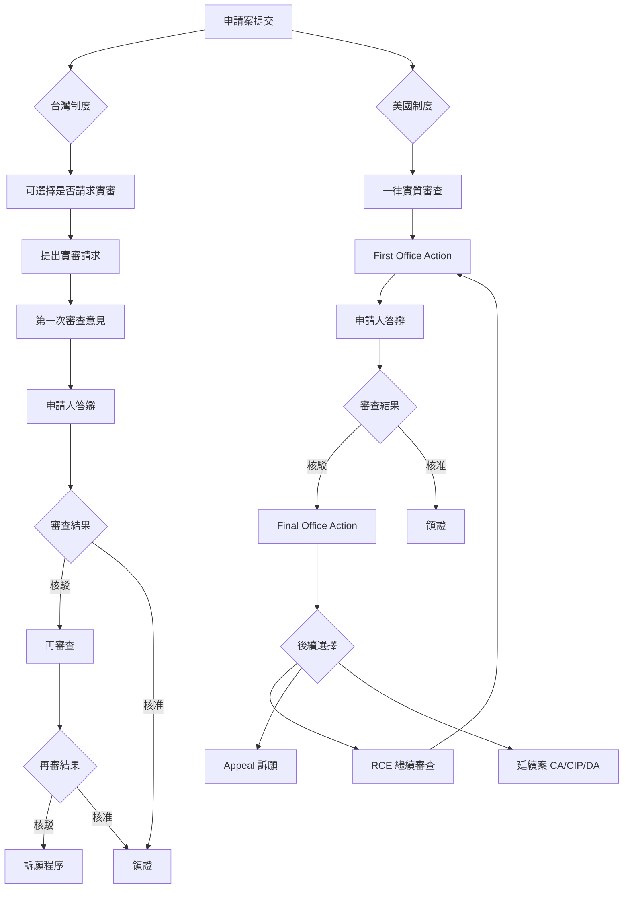

**核心差異**:
- **台灣**: 請求實審制，有二次實體審查機會（初審 + 再審）
- **美國**: 一律實審，單次實體審查，但可透過 RCE 回到 USPTO 繼續審理

---

## 2. 審查意見閱讀及期限

### 2.1 答辯期限規範

#### 法定期限 (Statutory Period)
- **原則**: 6個月 (35 USC 133)
- **實務**: USPTO 通常會指定較短期限

#### 指定期限 (Shortened Statutory Period, SSP)
- **通常**: 3個月
- **目的**: 加快審查進度

#### 延期規則
- **延長上限**: 至多延5個月，或延至法定期限（兩者取較早者）
- **延期費用**: 分1個月、2個月、3個月、4個月延期費 (37 CFR 1.17(a))

**關鍵實務差異**:
台灣需先申請延期獲准後才能繳費；美國只要提出答辯時同時提出延期請求並繳納延期費即可，無需等待核准。

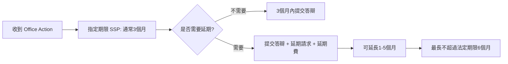

### 2.2 Information Disclosure Statement (IDS) 資訊揭露義務

#### 目的
避免 Inequitable Conduct (不正行為) 導致專利不能行使

#### 義務人 (37 CFR 1.56(c))
1. 發明人
2. 代理人
3. 實質涉及準備申請案及答辯的人

#### 提交時機與費用

| 提交時間 | 法規依據 | 費用 | 額外要求 |
|---------|---------|------|---------|
| First OA 前3個月內 | 37 CFR 1.97(b) | 免費 | 無 |
| First OA 後至 FOA/NoA 前 | 37 CFR 1.97( c) | 需繳費 | 無 |
| FOA/NoA 後至繳領證費前 | 37 CFR 1.97(d) | 需繳費 | 需同時提交 RCE/CA 或提供 IDS statement 或 QPIDS |

#### 非英文文件處理
- 可提交機器翻譯本 (例如 Google Translation)
- 無需提供正式翻譯

### 2.3 Quick Path IDS (QPIDS)

#### 適用對象
領證費繳納後需提交 IDS 的 Utility 或 Reissue 案件（Design 不適用）

#### 需提交文件
1. IDS 資訊
2. 37 CFR 1.97(e) statement
3. 37 CFR 1.17(p) IDS Fee
4. RCE request
5. 37 CFR 1.17(h) ePetition fee

#### 優點
- 無需官費
- 可能省去 RCE 程序（審查員認為無需重啟審查則退回 RCE 費用）

#### 限制
不得修正請求項 (No amendments)

### 2.4 Office Action 結構

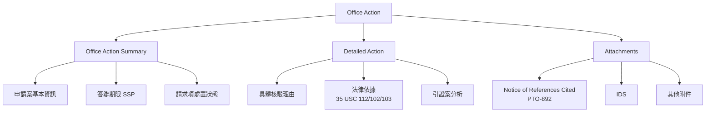

#### Office Action Summary 內容
1. 申請案資訊（申請號、申請日、審查員等）
2. 答辯期限 (Shortened Statutory Period)
3. 請求項處置狀態
   - Allowed (核准)
   - Objected to (異議)
   - Rejected (核駁)
   - Subject to restriction (限制要求)
   - Withdrawn (撤回)

#### Detailed Action 內容
- 每一請求項的具體核駁理由
- 法律依據（35 USC 112, 102, 103等）
- 引證案的具體揭露內容
- 審查員的比對分析

### 2.5 審查意見完整性要求 (37 CFR 1.104)

審查意見必須包含:
1. **每一請求項的處置**
   - Allowed / Objected to / Rejected / Subject to restriction / Withdrawn

2. **核駁請求項的核駁理由及法律依據**
   - 必須明確指出違反哪一條法規
   - 必須說明為何違反

3. **所引用的引證案**
   - 例外: Official Notice (據稱常識)

### 2.6 Official Notice (據稱常識)

#### 規則
1. **不得單獨使用**: 不得單獨以 Official Notice 核駁，必須結合引證案
2. **證明標準**: 據稱常識必須能直接且無歧異地被證明為 well-known
3. **申請人反駁**: 申請人適當反駁後，審查員須於下次 OA 提出證據證明
4. **FOA 限制**: Official Notice 不應於 Final OA 出現 (MPEP 2144.03)

#### 實務建議
- 若收到以 Official Notice 為基礎的核駁，應積極反駁
- 要求審查員提供具體證據支持其主張
- 若在 FOA 出現 Official Notice，可主張程序瑕疵

---

## 3. 修正規範、答辯要求及 Template

### 3.1 答辯要求 (Fully Responsive, 37 CFR 1.111)

#### 完整答辯必須包含
1. **完整回應每一核駁理由** (rejection, objection, requirement)
2. **說明請求項與引證案的區別**，且該區別使請求項具可專利性
3. **修正的 claim 需說明為何 patentable over references**
4. **需有「促進審查的善意企圖」** (bona fide attempt to advance)

#### Fully Responsive 判斷標準

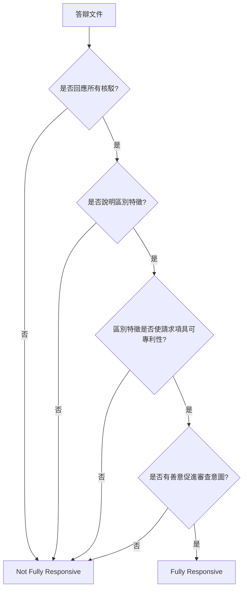

### 3.2 請求項修正規範 (37 CFR 1.121)

#### 狀態標記 (Status Identifier)

| 標記 | 說明 |
|------|------|
| **Original** | 原始提交的請求項 |
| **Currently Amended** | 本次修正的請求項 |
| **Previously Presented** | 先前提交且非 original 的請求項 |
| **Cancelled** | 已刪除的請求項 |
| **Withdrawn** | 撤回的請求項 |
| **New** | 新增的請求項 |
| **Not Entered** | 先前提交但未被受理的請求項 |

#### 修正標記方式

1. **新增內容**: 使用底線
   ```
   A device comprising a processor and a memory
   ```

2. **刪除內容**: 使用刪除線
   ```
   A device comprising a processor and a memory
   ```

3. **5個或更少字元的刪除**: 使用雙中括號
   ```
   A device comprising [[an]] a processor
   ```

#### 請求項修正範例

```
1. (Currently Amended) A device comprising:
   a processor configured to process data;
   a memory coupled to the processor; and
   a communication interface configured to transmit processed data.
```

### 3.3 說明書修正規範

#### 修正方式
必須採用「增加、刪除、或替換段落」方式

#### 範例格式
```
Replace the paragraph starting at line 3 of page 10 with the following paragraph:

[新段落內容]
```

#### Substitute Specification
若修正內容很多，可採用 substitute Specification 方式 (37 CFR 1.125(b), (c))

### 3.4 圖式修正規範

1. **修正圖式**: 頂端標註 "Replacement Sheet"
2. **新增圖式**: 標註 "New Sheet"
3. **複雜修正**: 可提交 "Annotated Sheet" 並於 remark 說明

### 3.5 Interview (面詢/電詢)

#### 時機限制

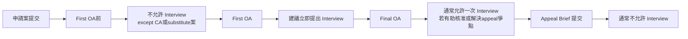

#### 面詢形式
1. **面對面**: 親自至 USPTO
2. **視訊會議**: 線上面詢
3. **電話**: 電詢

#### 提交文件
- **Applicant Initiated Interview Request Form** (PTOL-413A)

#### 限制
- 提交 Appeal brief 或收到核准通知後通常不允許 interview
- FOA 後 interview 並非申請人權利（審查員可拒絕）

---

## 4. Final Office Action (FOA) 及其後續處理

### 4.1 Final Office Action 發出條件

#### 原則
第二次或後續實審 Office Action 應為 Final，**除非**:

1. 審查員提出**新核駁理由**
2. 該新理由**並非**基於申請人修正而必須的
3. 該新理由**並非**基於申請人在 37 CFR 1.97(c) 期間經繳費提交的 IDS

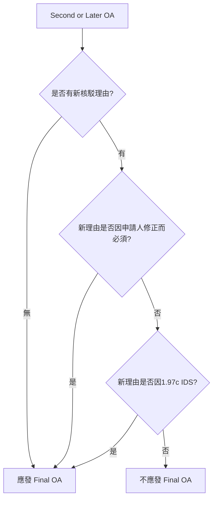

#### 不適當 FOA (Premature Final OA)

**情況**: 
- 單純意見陳述即克服原核駁事由
- 審查員提出新核駁理由

**處理**:
可要求撤回 Finality of the OA

### 4.2 FOA 後修正限制 (37 CFR 1.116)

#### 僅允許以下修正

1. **刪除請求項** 或 **克服形式核駁的修正**
2. **為提出訴願而修正為較佳形式**
3. **涉及實體的修正**
   - 需提出好且足夠的理由說明:
     - 為何此修正是必須的
     - 為何未早點提出

### 4.3 FOA 後答辯選項

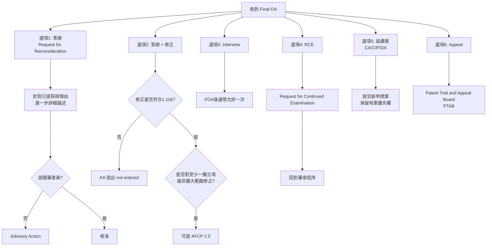

### 4.4 FOA 彈性指定期限 (Flexible SSP)

#### 規則
- 回覆 FOA 的 SSP 為 3個月
- 若申請人於收到 FOA **2個月內**提出答辯
- 且 USPTO 在 3個月內未發出 Advisory Action
- 則指定期限為 **AA 發出當日**
- 延期費從該日隔天起算

#### 例外
若官方設定 SSP 短於 3個月，不適用彈性 SSP

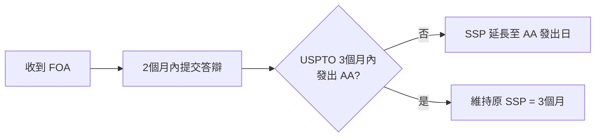

### 4.5 After Final Consideration Pilot 2.0 (AFCP 2.0)

#### 目前狀態
延長至 2021年9月30日

#### 提出條件
1. 收到 Final Office Action
2. 提出答辯並包含對**至少一個獨立項**做**非擴大範圍的修正**
3. 同意審查員主動致電討論

#### 優點
- **無官費**
- 有機會在不提交 RCE 情況下獲准專利
- 審查員致電相當於多一次審查意見

#### 限制
若所需時間超過 3小時 或 仍不具可專利性，將發出 Advisory Action

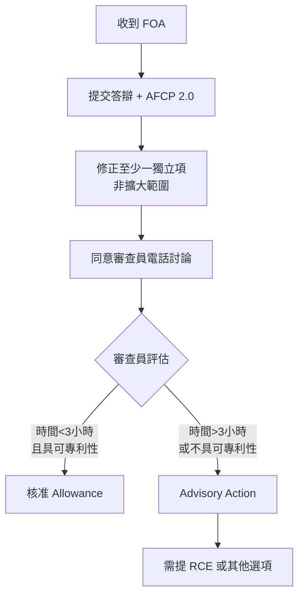

---

## 5. Request for Continued Examination (RCE) 及延續案

### 5.1 RCE 基本概念 (35 USC 132(b))

#### 提出時機
- 案件審查結束 (Closed) 後
- 案件被視為 abandoned 之前
- 繳領證費之前
- 上訴至 CAFC 之前

#### 需提交內容
1. **A request** (RCE 請求)
2. **A submission** (提交內容)
   - 答辯含修正
   - IDS
   - Appeal brief
   - FOA 後未被 entered 的 amendment 等
3. **費用** (不可補繳)

#### 重要特性
- **並無新申請日/號**
- 以先前已繳 claim 費用項數計算超項費
- RCE 不得用於 switch 發明（不能切換為與原請求項 independent and distinct 之發明, 37 CFR 1.145）

### 5.2 Submission for RCE 要求

#### 必須滿足 35 USC 132, 37 CFR 1.114

**可以是**:
- 說明書、圖式、或請求項的修正
- 新的答辯理由
- 支持可專利性的證據
- IDS（限於收到核准通知者）
- FOA 後提交但未被 entered 的答辯理由或 amendments

**不滿足要求**:
- 中止審查請求
- Appeal brief
- Reply brief

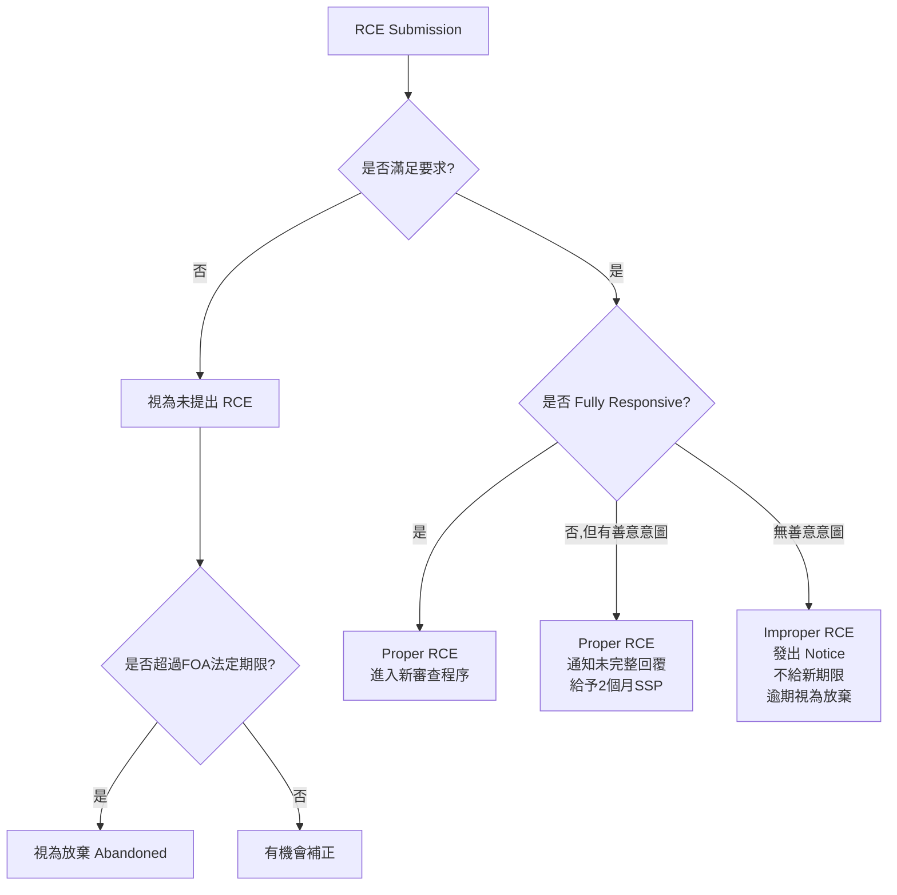

#### Improper RCE 範例
未回覆 FOA 核駁理由，僅提交 IDS

### 5.3 延續案 (Continuing Applications)

#### 5.3.1 Continuation Application (CA) - 延續案

**定義**:
- 相對於母案**不得有新事項** (New Matter)
- The disclosure must not include any subject matter which would constitute new matter (MPEP 201.07)

**特性**:
- 說明書內容與母案相同
- 請求項範圍可以不同
- 可獲得母案申請日利益

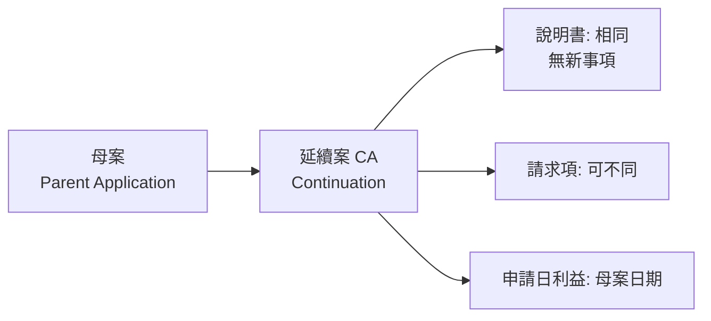

#### 5.3.2 Divisional Application (DA) - 分割案

**定義**:
- 從母案分離出來的**獨立且有區別的發明**
- Often filed as a result of a restriction requirement (MPEP 201.06)

**重要**: 
依 MPEP 並非有限制要求才能提 DA

**特性**:
- 說明書內容與母案相同
- 請求項為母案中未選發明
- 可獲得母案申請日利益

#### 5.3.3 Continuation-in-part Application (CIP) - 部分延續案

**定義**:
- 重複母案**部分或全部內容**並**增加新事項**
- Repeating some substantial portion and adding matter not disclosed in earlier application (MPEP 201.08)

**關鍵**:
- 只有能被母案支持的 claims 能得到母案申請日利益
- 新事項部分以 CIP 申請日為準

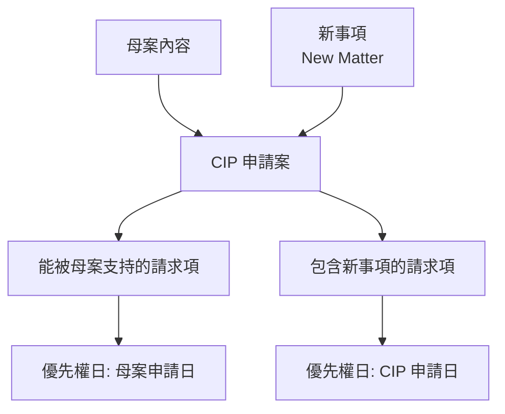

### 5.4 FOA 後提延續案常見方式

#### 策略 1: 較窄範圍先核准
- 讓較窄範圍核准先獲得專利
- 以 CA 爭取較寬範圍

#### 策略 2: 未選發明處理
- 曾有限制要求且有未選發明
- 將未選發明以 DA 提出

#### 策略 3: 有新技術特徵情況

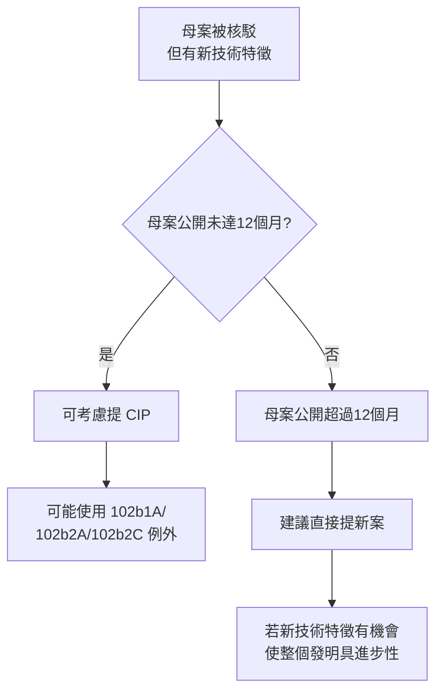

---

## 6. 答辯陳述實務建議

### 6.1 避免自行放棄 (Disclaimer)

#### 曾構成 Disclaimer 的陳述

**案例 1**: Saffran v. Johnson & Johnson, 712 F.3d 549
```
"The device used is a sheet rather than a pre-formed chamber"
```
→ 被認定為限縮解釋

**案例 2**: American Piledriving Equipment v. Geoquip, 637 F.3d 1324
```
"In other words, the claims recite..."
```
→ 明確限縮解釋

**案例 3**: Sentry Protection Products v. Eagle Mfg., 400 F.3d 910
```
"not a plurality of components...as required by claims"
```
→ 加入請求項未明確記載的限制

#### 不構成 Disclaimer 的陳述

**案例**: Retractable Techs. v. Becton, Dickinson, 653 F.3d 1296
- 單純 argue 某個 prior art 的困難與失敗
- 不構成對請求項的限縮

### 6.2 答辯陳述方式建議

#### 情境
審查意見表示：引證1的A揭露 claim 1 的元件B

#### 建議寫法（優先順序）

**優先 1**:
```
引證1揭示A，未揭示B
```

**優先 2**:
```
引證1揭示AAA（從引證1說明書貼過來），未揭示B
B是BBB（從申請案說明書貼過來）
```

**優先 3**:
```
引證1揭示A'，未揭示B
```

#### 避免寫法

**避免 1**:
```
引證案揭示A'，並未揭示B
B is B' as required in claim 1
```
→ 可能構成限縮

**避免 2**:
```
引證1的A應該是對應發明的C
```
→ 可能構成限縮

### 6.3 關鍵原則

1. **若限縮式寫法無法避免，一定要指明是哪一個 claim**
2. **考慮電詢 (Interview)**，減少審查歷史禁反言
3. **避免使用 "as required in claim X"** 等明確限縮用語
4. **使用客觀描述**，避免主觀解釋

---

## 7. 特殊議題

### 7.1 New Issue vs. New Matter

#### New Matter (新事項)
**定義**: 未能被 originally filed 說明書（含 originally filed claims）及圖式支持的內容

#### New Issue (新議題)
**定義**: 超出已審查過 claim 範疇

**範例**:
- 從說明書找特徵加到現有 claim
- 合併附屬特徵，而此合併範圍未曾出現過

#### 特殊案例

**情況**:
1. First OA: 大範圍駁，小範圍准
2. 修 claim 1 成中範圍
3. 收到 FOA
4. 想改回當初已可核准的小範圍

**問題**: 是否屬 new issue?

**建議**: 答辯時即改寫小範圍為獨立項

### 7.2 請求項修正方式對 FOA 的影響

#### 範例情境

**原範圍**:
```
1. 裝置包含A和B
2. 如1更包含C
3. 如1更包含D
```

**First OA 後修改成**:
```
1. (Currently Amended) 裝置包含A、C和B
2. (Cancelled)
3. (Currently Amended) 如1更包含D
```

#### 理論 vs. 實際

**理論**:
- 修改後請求項1範圍 = 原請求項2範圍
- 審查員若提新核駁理由不應發 FOA
- 因新核駁理由非針對申請人修改所必須

**實際**:
- 審查員通常堅持 FOA
- 因請求項1範圍有變動

#### 避免收到 FOA 的建議修改方式

```
1. (Cancelled)
2. (Currently Amended) 如請求項1所述裝置更包含一種裝置包含A、B和C
3. (Currently Amended) 如請求項[[1]]2所述裝置更包含D
```

### 7.3 核准後修正 (MPEP 714.16)

#### 需滿足四點說明

1. **Why the amendment is needed** (為何需要此修正)
2. **Why the proposed amended or new claims require no additional search or examination** (為何不需額外檢索或審查)
3. **Why the claims are not patentable** (為何請求項不具可專利性) - 此為原文表述，實際應說明為何具可專利性
4. **Why they were not presented earlier** (為何未早點提出)

#### 範例情境

**情況**:
1. First OA 核駁 claims 1-34
2. Response 修正部分 claims 並刪除部分、新增 claims 35-52
3. 收到核准通知
4. 客戶想增加 claims 依附 22, 33

**處理**: 需依上述四點說明

### 7.4 Interview after FOA 詳細規則

#### 允許情況
- FOA 後**通常**允許一次 interview
- 若有助核准或解決 appeal 爭點

#### 不允許情況
- FOA 後 interview 並非申請人權利（可不允許）
- 僅重申先前答辯理由
- 討論需進一步檢索限制條件

#### 特殊時機
- 在 FOA 的 SSP 之後但 SP 之前的 interview
- 可在不繳延期費情形下提出與進行 (706.07(f), 713.09)

#### 第二次 Interview
- FOA 後第二次 interview 可能被允許
- 若審查員認為將能加快 appeal 爭點或申請案處置

#### 嚴格限制
- 收到核准通知後 interview 需 TC director 同意
- 提交 Appeal brief 或收到核准通知後通常不允許 interview (MPEP 713.05, 713.09)

---

## 附錄: 美國專利審查流程完整圖

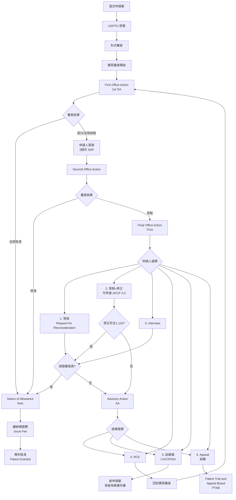

---

## 課程重點總結

### 台美審查流程核心差異
1. 台灣採請求實審制，美國一律實審
2. 台灣有二次實體審查機會，美國透過 RCE 繼續審查
3. 延期請求處理方式不同（台灣需核准，美國僅需提出並繳費）

### 答辯期限管理
- 法定期限 6個月，通常指定 3個月 SSP
- 可延長至多 5個月或至法定期限
- FOA 後有彈性 SSP 機制

### IDS 提交策略
- First OA 前 3個月內免費
- 把握時機避免額外費用
- 非英文文件可用機器翻譯

### FOA 處理多元選項
- 答辯、答辯+修正、Interview
- RCE（最常用）
- 延續案（CA/CIP/DA）
- Appeal

### 答辯陳述注意事項
- 避免 Disclaimer 限縮解釋
- 使用客觀描述而非主觀解釋
- 必要時指明特定 claim
- 考慮 Interview 減少書面記錄

---

**課程文件製作日期**: 2025-11-27  
**基於課程**: US02 美國專利審查流程與答辯實務 (2021-03-09)  
**講師**: Jamie Lu