# 台灣發明專利程序流程圖

## 名詞定義表

| 名詞 | 定義 | 引用法條 | 備註 |
|------|------|----------|------|
| 申請 | 由專利申請權人備具申請書及相關文件向專利專責機關提出，以取得專利權的初步行為 | 第25條第1項 | - |
| 申請日 | 申請書、說明書、申請專利範圍及必要圖式齊備之日 | 第25條第2項 | - |
| 優先權 | 基於在特定期間內曾於國外或國內第一次申請相同技術，以此為審查基準日的權利 | 第28條第1項、第30條第1項 | 國際優先權12個月、國內優先權12個月 |
| 補正 | 申請文件不符合法定程式但可補正時，由機關通知申請人限期補辦齊備 | 細則第11條 | - |
| 回復原狀 | 因天災或不可歸責於己之事由遲誤法定期間者，申請恢復其程序效力的機制 | 第17條第2項 | 原因消滅後30日內，但遲誤已逾1年不得申請 |
| 分割 | 一申請案實質包含二個以上發明時，申請將其拆分為數個獨立申請案，並援用原申請日 | 第34條第1項 | 應於再審查審定前為之 |
| 改請 | 申請人將原申請案變更為另一專利種類，並援用原申請日 | 第107條第1項 | 有時間限制 |
| 撤回 | 申請人主動放棄該專利申請案的後續程序 | 第12條第2項 | 需共同連署 |
| 早期公開 | 發明專利自申請日起滿18個月，機關將其技術內容揭露於公開公報 | 第37條第1項 | 可申請提前公開 |
| 實體審查 | 針對發明專利之專利要件進行實質檢索與判斷 | 第38條第1項、第46條第1項 | 申請日起3年內需請求 |
| 再審查 | 不服不予專利之初審審定時，得申請由未曾審查原案之人員再次審查 | 第49條第1項 | 審定書送達後2個月內 |
| 面詢 | 申請人至專利機關當面說明技術內容或釐清爭點的程序 | 第48條 | 審查人員認有必要時 |
| 修正 | 於審定前主動或依通知對說明書、申請專利範圍或圖式進行修改 | 第43條第1項 | 不得超出原揭露範圍 |
| 領證 | 經核准審定後，繳納證書費及首年年費以取得專利證書的程序 | 第52條第1項 | 審定書送達後3個月內 |
| 專利年費 | 為維持專利權有效，每年應定期繳納之費用 | 第86條 | 逾期可於6個月內補繳並加繳倍數年費 |
| 更正 | 於公告取得專利權後，因刪除請求項、減縮範圍或訂正誤記等目的所做的修改 | 第67條第1項 | 不得實質擴大或變更公告範圍 |
| 舉發 | 任何人認專利有違法事由，申請撤銷該專利權 | 第71條第1項 | 公眾審查制度 |
| 訴願 | 對專利專責機關處分不服，向上級機關申請救濟 | 第97條第1項 | 30日內提起 |
| 行政訴訟 | 對訴願決定不服，向智慧財產及商業法院提起救濟 | 第97條第2項 | - |

---

## 流程圖

```mermaid
flowchart TD
    Start([開始專利申請])
    
    subgraph 申請與形式
        A1[備具申請文件\n引用法條：第25條第1項]
        A2{文件齊備?}
        A3[認定申請日\n引用法條：第25條第2項]
        A4[補正通知\n引用法條：細則第11條]
        A5{期限內補正?}
        A6[不予受理\n引用法條：第17條第1項]
        A7{主張優先權?}
        A8[國際優先權\n引用法條：第28條｜定位提示：12個月內]
        A9[國內優先權\n引用法條：第30條第1項｜定位提示：12個月內]
        A10{涉及生物材料?}
        A11[生物材料寄存\n引用法條：第27條第1項、第2項]
        A12{回復原狀申請?}
        A13[回復原狀審查\n引用法條：第17條第2項]
        A14{申請案狀態變更?}
        A15[分割申請\n引用法條：第34條第1項｜定位提示：再審查審定前]
        A16[改請申請\n引用法條：第107條第1項]
        A17[形式審查完成]
    end
    
    subgraph 實體審查
        B1[早期公開\n引用法條：第37條第1項｜定位提示：申請日起18個月]
        B2{申請日起3年內\n請求實體審查?}
        B3[視為撤回\n引用法條：第38條第3項]
        B4[實體審查開始\n引用法條：第46條第1項]
        B5{符合專利要件?}
        B6[審查意見通知\n引用法條：第46條第1項｜定位提示：限期申復]
        B7{申請人申復?}
        B8[修正說明書/範圍\n引用法條：第43條第1項、第2項]
        B9{面詢?}
        B10[面詢程序\n引用法條：第48條]
        B11[不予專利審定\n引用法條：第51條第2項]
        B12[准予專利審定\n引用法條：第51條第1項]
        B13{申請再審查?}
        B14[再審查程序\n引用法條：第49條｜定位提示：送達後2個月內]
    end
    
    subgraph 核准與維持
        C1{審定後3個月內\n繳納證書費及年費?}
        C2[專利權自始不存在\n引用法條：第52條第3項]
        C3[公告專利權\n引用法條：第52條第5項]
        C4[專利權生效\n引用法條：第52條第6項｜定位提示：公告日起算]
        C5[年費繳納\n引用法條：第86條第2項]
        C6{逾期6個月內\n補繳?}
        C7[專利權當然消滅\n引用法條：第70條第1項第3款]
        C8{申請更正?}
        C9[更正審查\n引用法條：第67條｜定位提示：不得擴大範圍]
        C10{醫藥品/農藥品\n申請延長?}
        C11[專利權期限延長\n引用法條：第53條｜定位提示：最長5年]
        C12[專利權維持中]
    end
    
    subgraph 第三人程序
        D1[舉發程序啟動\n引用法條：第71條第1項]
        D2[舉發審查\n引用法條：第73條]
        D3{舉發成立?}
        D4[專利權撤銷\n引用法條：第70條第1項第4款]
        D5[舉發不成立\n引用法條：第73條第3項]
    end
    
    subgraph 救濟
        E1{對不予專利審定\n提起再審查?}
        E2[再審查審定\n引用法條：第49條第3項]
        E3{提起訴願?}
        E4[訴願程序\n引用法條：第97條第1項｜定位提示：30日內]
        E5{訴願決定\n維持原處分?}
        E6{提起行政訴訟?}
        E7[行政訴訟\n引用法條：第97條第2項]
        E8[救濟程序終結]
    end
    
    End1([專利權取得])
    End2([程序終止])
    
    %% 申請與形式階段流程
    Start --> A1
    A1 --> A2
    A2 -->|是| A3
    A2 -->|否| A4
    A4 --> A5
    A5 -->|是| A3
    A5 -->|否| A6
    A6 --> End2
    A3 --> A7
    A7 -->|是-國際| A8
    A7 -->|是-國內| A9
    A7 -->|否| A10
    A8 --> A10
    A9 --> A10
    A10 -->|是| A11
    A10 -->|否| A12
    A11 --> A12
    A12 -->|是| A13
    A12 -->|否| A14
    A13 --> A14
    A14 -->|分割| A15
    A14 -->|改請| A16
    A14 -->|否| A17
    A15 --> A17
    A16 --> A17
    A17 --> B1
    
    %% 實體審查階段流程
    B1 --> B2
    B2 -->|否| B3
    B3 --> End2
    B2 -->|是| B4
    B4 --> B5
    B5 -->|是| B12
    B5 -->|否| B6
    B6 --> B7
    B7 -->|是| B8
    B7 -->|否| B11
    B8 --> B9
    B9 -->|是| B10
    B9 -->|否| B4
    B10 --> B4
    B11 --> B13
    B13 -->|是| B14
    B13 -->|否| E1
    B14 --> B5
    B12 --> C1
    
    %% 核准與維持階段流程
    C1 -->|否| C2
    C2 --> End2
    C1 -->|是| C3
    C3 --> C4
    C4 --> C10
    C10 -->|是| C11
    C10 -->|否| C5
    C11 --> C5
    C5 --> C6
    C6 -->|否| C7
    C7 --> End2
    C6 -->|是| C8
    C8 -->|是| C9
    C8 -->|否| C12
    C9 --> C12
    C12 --> C5
    C12 --> End1
    
    %% 第三人程序（可隨時啟動）
    C4 -.->|任何人提起| D1
    C12 -.->|任何人提起| D1
    D1 --> D2
    D2 --> D3
    D3 -->|是| D4
    D3 -->|否| D5
    D4 --> End2
    D5 --> C12
    
    %% 救濟程序
    E1 -->|是| E2
    E1 -->|否| E3
    E2 --> E3
    B11 --> E3
    D3 -.->|不服| E3
    E3 -->|是| E4
    E3 -->|否| End2
    E4 --> E5
    E5 -->|是| E6
    E5 -->|否| End1
    E6 -->|是| E7
    E6 -->|否| End2
    E7 --> E8
    E8 --> End2
    
    %% 樣式定義
    classDef startEnd fill:#90EE90,stroke:#333,stroke-width:3px, color:#000000, font-size:28px
    classDef process fill:#87CEEB,stroke:#333,stroke-width:2px, color:#000000, font-size:28px
    classDef decision fill:#FFD700,stroke:#333,stroke-width:2px, color:#000000, font-size:28px
    classDef termination fill:#FF6B6B,stroke:#333,stroke-width:2px, color:#000000, font-size:28px
    
    class Start,End1 startEnd
    class A1,A3,A4,A8,A9,A11,A13,A15,A16,A17,B1,B4,B6,B8,B10,B14,C3,C4,C5,C9,C11,D1,D2,E2,E4,E7 process
    class A2,A5,A7,A10,A12,A14,B2,B5,B7,B9,B13,C1,C6,C8,C10,D3,E1,E3,E5,E6 decision
    class A6,B3,B11,C2,C7,D4,End2,E8 termination
    class B12,D5,C12 startEnd
```

---

## 步驟-法條對照清單

### 階段一：申請與形式（Filing & Formalities）

#### 1. 備具申請文件
- **步驟簡述**：申請人備具申請書、說明書、申請專利範圍、摘要及必要圖式
- **引用法條**：第25條第1項
- **上一步**：無（起始步驟）
- **下一步**：文件齊備檢查

#### 2. 文件齊備檢查
- **步驟簡述**：專利專責機關檢查申請文件是否符合法定程式
- **引用法條**：細則第11條
- **上一步**：備具申請文件
- **下一步**：齊備→認定申請日；不齊備→補正通知

#### 3. 認定申請日
- **步驟簡述**：以申請書、說明書、申請專利範圍及必要圖式齊備之日為申請日
- **引用法條**：第25條第2項
- **上一步**：文件齊備
- **下一步**：優先權主張檢查

#### 4. 補正通知
- **步驟簡述**：專利專責機關通知申請人限期補正不符法定程式之處
- **引用法條**：細則第11條
- **上一步**：文件不齊備
- **下一步**：期限內補正檢查
- **期限**：專利專責機關指定期間／失權效果：屆期未補正或補正不齊備者不受理

#### 5. 不予受理
- **步驟簡述**：因遲誤法定或指定期間，申請案不受理
- **引用法條**：第17條第1項
- **上一步**：補正期限屆滿未補正
- **下一步**：程序終止

#### 6. 主張國際優先權（可選）
- **步驟簡述**：基於在互惠國第一次申請，於12個月內主張優先權
- **引用法條**：第28條第1項｜定位提示：12個月內
- **上一步**：認定申請日
- **下一步**：生物材料寄存檢查
- **期限**：第一次申請日後12個月內（細則第25條第1項）／起算點：第一次申請日次日

#### 7. 主張國內優先權（可選）
- **步驟簡述**：基於國內先申請案，於12個月內主張優先權
- **引用法條**：第30條第1項｜定位提示：12個月內
- **上一步**：認定申請日
- **下一步**：生物材料寄存檢查
- **期限**：先申請案申請日後12個月內（細則第25條第2項）／起算點：先申請案申請日次日

#### 8. 生物材料寄存（條件性）
- **步驟簡述**：申請生物材料或利用生物材料之發明，應於申請日寄存並檢送證明
- **引用法條**：第27條第1項、第2項
- **上一步**：優先權主張（或跳過）
- **下一步**：回復原狀檢查
- **期限**：最遲申請日寄存／申請日後4個月內檢送證明（主張優先權時為最早優先權日後16個月）／失權效果：視為未寄存

#### 9. 回復原狀（條件性）
- **步驟簡述**：因天災或不可歸責事由遲誤法定期間，申請回復原狀
- **引用法條**：第17條第2項
- **上一步**：生物材料寄存（或跳過）
- **下一步**：申請案狀態變更檢查
- **期限**：原因消滅後30日內／起算點：原因消滅日次日／失權效果：遲誤已逾1年不得申請

#### 10. 分割申請（可選）
- **步驟簡述**：一申請案包含二個以上發明，申請分割為數個獨立申請案
- **引用法條**：第34條第1項｜定位提示：再審查審定前
- **上一步**：申請案狀態變更決定
- **下一步**：形式審查完成
- **期限**：再審查審定前（第34條第2項第1款）／失權效果：逾期不得分割

#### 11. 改請申請（可選）
- **步驟簡述**：將發明專利申請改為新型專利申請或反之
- **引用法條**：第107條第1項
- **上一步**：申請案狀態變更決定
- **下一步**：形式審查完成
- **期限**：准予專利審定書送達前；不予專利審定書送達後2個月內（第107條第2項）／失權效果：逾期不得改請

#### 12. 形式審查完成
- **步驟簡述**：完成申請與形式階段所有程序
- **引用法條**：法規未提供｜流程用語定義：形式階段完成，進入公開程序
- **上一步**：分割/改請（或跳過）
- **下一步**：早期公開

---

### 階段二：實體審查（Substantive Examination）

#### 13. 早期公開
- **步驟簡述**：申請日起滿18個月，公開申請案技術內容於公報
- **引用法條**：第37條第1項｜定位提示：申請日起18個月
- **上一步**：形式審查完成
- **下一步**：請求實體審查檢查
- **期限**：申請日起滿18個月自動公開／起算點：申請日

#### 14. 請求實體審查
- **步驟簡述**：申請人於申請日起3年內請求實體審查並繳納審查費
- **引用法條**：第38條第1項｜定位提示：3年內
- **上一步**：早期公開
- **下一步**：實體審查開始
- **期限**：申請日起3年內（第38條第1項）／起算點：申請日／失權效果：期滿未請求視為撤回（第38條第3項）

#### 15. 視為撤回
- **步驟簡述**：申請日起3年內未請求實體審查，申請案視為撤回
- **引用法條**：第38條第3項
- **上一步**：請求實體審查期限屆滿未請求
- **下一步**：程序終止

#### 16. 實體審查開始
- **步驟簡述**：審查人員進行新穎性、進步性、產業利用性等專利要件審查
- **引用法條**：第46條第1項
- **上一步**：請求實體審查
- **下一步**：專利要件符合性判斷

#### 17. 審查意見通知
- **步驟簡述**：審查人員認申請案不符規定，通知申請人限期申復
- **引用法條**：第46條第1項｜定位提示：限期申復
- **上一步**：專利要件不符
- **下一步**：申請人申復檢查
- **期限**：專利專責機關指定期間／失權效果：屆期未申復視為不符規定

#### 18. 修正說明書/申請專利範圍
- **步驟簡述**：申請人修正說明書、申請專利範圍或圖式以克服審查意見
- **引用法條**：第43條第1項、第2項
- **上一步**：申請人決定申復
- **下一步**：面詢檢查
- **期限**：專利專責機關指定期間內

#### 19. 面詢程序（可選）
- **步驟簡述**：審查人員認有必要，通知申請人或代理人面詢
- **引用法條**：第48條
- **上一步**：修正後
- **下一步**：實體審查

#### 20. 不予專利審定
- **步驟簡述**：申請案不符專利要件，作成不予專利審定
- **引用法條**：第51條第2項
- **上一步**：申請人未申復或申復後仍不符
- **下一步**：再審查申請檢查

#### 21. 再審查程序
- **步驟簡述**：不服不予專利審定，由未曾審查原案人員再次審查
- **引用法條**：第49條｜定位提示：送達後2個月內
- **上一步**：申請人申請再審查
- **下一步**：專利要件重新判斷
- **期限**：審定書送達後2個月內（第49條第2項第1款）／起算點：審定書送達日次日／失權效果：逾期不得申請

#### 22. 准予專利審定
- **步驟簡述**：申請案符合專利要件，作成准予專利審定
- **引用法條**：第51條第1項
- **上一步**：專利要件符合
- **下一步**：領證程序

---

### 階段三：核准與維持（Grant & Maintenance）

#### 23. 領證程序
- **步驟簡述**：審定書送達後3個月內繳納證書費及第一年專利年費
- **引用法條**：第52條第1項
- **上一步**：准予專利審定
- **下一步**：繳費檢查
- **期限**：審定書送達後3個月內（第52條第1項）／起算點：審定書送達日次日／失權效果：期滿未繳費，專利權自始不存在（第52條第3項）

#### 24. 專利權自始不存在
- **步驟簡述**：審定後3個月內未繳納證書費及年費，專利權自始不存在
- **引用法條**：第52條第3項
- **上一步**：領證期限屆滿未繳費
- **下一步**：程序終止

#### 25. 公告專利權
- **步驟簡述**：專利專責機關公告專利權於專利公報
- **引用法條**：第52條第5項
- **上一步**：繳納證書費及年費
- **下一步**：專利權生效

#### 26. 專利權生效
- **步驟簡述**：專利權自公告日起生效
- **引用法條**：第52條第6項｜定位提示：公告日起算
- **上一步**：公告專利權
- **下一步**：專利權期限延長檢查
- **期限**：專利權期限自申請日起算20年屆滿（第52條第2項）

#### 27. 專利權期限延長（條件性）
- **步驟簡述**：醫藥品或農藥品專利因取得許可證遲延實施，申請延長專利權期限
- **引用法條**：第53條｜定位提示：最長5年
- **上一步**：專利權生效（符合延長條件）
- **下一步**：年費繳納
- **期限**：取得許可證明後3個月內申請（第53條第2項）／延長上限：最長5年（第53條第3項）

#### 28. 年費繳納
- **步驟簡述**：專利權人每年應於期限屆滿前繳納專利年費
- **引用法條**：第86條第2項
- **上一步**：專利權生效或專利權期限延長
- **下一步**：逾期補繳檢查
- **期限**：每年屆期前繳納（第86條第2項）／寬限期：屆期後6個月內補繳並加繳倍數年費（第86條第3項）

#### 29. 專利權當然消滅（未繳年費）
- **步驟簡述**：專利權人未於寬限期內繳納或補繳年費，專利權當然消滅
- **引用法條**：第70條第1項第3款
- **上一步**：逾期6個月仍未補繳
- **下一步**：程序終止

#### 30. 更正審查（可選）
- **步驟簡述**：專利權人申請更正說明書、申請專利範圍或圖式
- **引用法條**：第67條｜定位提示：不得擴大範圍
- **上一步**：專利權維持中
- **下一步**：專利權維持
- **期限**：無期限限制，但有舉發案時應於舉發案審查中為之

#### 31. 專利權維持中
- **步驟簡述**：專利權人持續繳納年費，專利權維持有效
- **引用法條**：法規未提供｜流程用語定義：專利權有效存續狀態
- **上一步**：年費繳納或更正
- **下一步**：年費繳納（循環）或專利權取得（終點）

---

### 階段四：第三人程序（Third-Party Proceedings）

#### 32. 舉發程序啟動
- **步驟簡述**：任何人認專利權有違法事由，向專利專責機關提起舉發
- **引用法條**：第71條第1項
- **上一步**：專利權生效或維持中（任何時點）
- **下一步**：舉發審查

#### 33. 舉發審查
- **步驟簡述**：專利專責機關審查舉發理由及證據，得依職權審查
- **引用法條**：第73條
- **上一步**：舉發程序啟動
- **下一步**：舉發成立與否判斷

#### 34. 專利權撤銷
- **步驟簡述**：舉發成立，專利權經撤銷確定後當然消滅
- **引用法條**：第70條第1項第4款
- **上一步**：舉發成立
- **下一步**：程序終止

#### 35. 舉發不成立
- **步驟簡述**：舉發理由不成立，專利權維持有效
- **引用法條**：第73條第3項
- **上一步**：舉發審查認定不成立
- **下一步**：專利權維持

---

### 階段五：救濟（Appeal / Administrative Remedy）

#### 36. 再審查（第一次救濟）
- **步驟簡述**：對不予專利審定不服，申請再審查
- **引用法條**：第49條第3項
- **上一步**：不予專利審定
- **下一步**：訴願檢查

#### 37. 訴願程序
- **步驟簡述**：對專利專責機關處分不服，向經濟部提起訴願
- **引用法條**：第97條第1項｜定位提示：30日內
- **上一步**：再審查審定或不予專利審定或舉發決定
- **下一步**：訴願決定
- **期限**：處分書送達後30日內（依訴願法）／起算點：處分書送達日次日

#### 38. 行政訴訟
- **步驟簡述**：對訴願決定不服，向智慧財產及商業法院提起行政訴訟
- **引用法條**：第97條第2項
- **上一步**：訴願決定維持原處分
- **下一步**：救濟程序終結
- **期限**：訴願決定書送達後2個月內（依行政訴訟法）

#### 39. 救濟程序終結
- **步驟簡述**：行政救濟程序結束
- **引用法條**：法規未提供｜流程用語定義：救濟程序完成
- **上一步**：行政訴訟判決確定
- **下一步**：程序終止或專利權取得（依判決結果）

---

## 補充說明

### 期限總覽表

| 程序 | 期限 | 起算點 | 失權效果 | 法條 |
|------|------|--------|----------|------|
| 主張國際優先權 | 12個月 | 第一次申請日次日 | 喪失優先權 | 第28條、細則第25條第1項 |
| 主張國內優先權 | 12個月 | 先申請案申請日次日 | 喪失優先權 | 第30條、細則第25條第2項 |
| 生物材料寄存證明檢送 | 4個月（無優先權） 16個月（有優先權） | 申請日 最早優先權日 | 視為未寄存 | 第27條第2項、第3項 |
| 回復原狀申請 | 30日 | 原因消滅日次日 | 不得回復 | 第17條第2項 |
| 分割申請 | 再審查審定前 | - | 不得分割 | 第34條第2項第1款 |
| 改請申請（不予專利後） | 2個月 | 審定書送達日次日 | 不得改請 | 第107條第2項第2款 |
| 請求實體審查 | 3年 | 申請日 | 視為撤回 | 第38條第1項、第3項 |
| 再審查申請 | 2個月 | 審定書送達日次日 | 不得申請 | 第49條第2項第1款 |
| 領證繳費 | 3個月 | 審定書送達日次日 | 專利權自始不存在 | 第52條第1項、第3項 |
| 年費補繳寬限期 | 6個月 | 應繳日屆滿日次日 | 專利權當然消滅 | 第86條第3項 |
| 專利權期限延長申請 | 3個月 | 取得許可證明日次日 | 不得延長 | 第53條第2項 |
| 訴願提起 | 30日 | 處分書送達日次日 | 訴願不受理 | 第97條第1項、訴願法 |

### 條件性程序說明

1. **主張優先權**：僅於申請人曾在互惠國或國內先申請時適用
2. **生物材料寄存**：僅於發明涉及生物材料且非易於獲得時適用
3. **回復原狀**：僅於因天災或不可歸責事由遲誤法定期間時適用
4. **分割/改請**：申請人基於需求主動選擇
5. **面詢**：審查人員認有必要時通知
6. **專利權期限延長**：僅適用於醫藥品或農藥品專利
7. **更正**：專利權人於必要時申請
8. **舉發**：任何人（或利害關係人）於專利權公告後提起

### 法規未明確規定之處

以下節點因法規未提供充分依據，已標示為流程用語：
- **形式審查完成**：法規未定義此階段名稱，為流程銜接用語
- **專利權維持中**：法規未定義此狀態名稱，為流程表述用語
- **救濟程序終結**：法規未定義此階段名稱，為流程結束用語

---

**檔案產出日期**：2025年1月
**法規依據**：台灣專利法暨施行細則（完整版）
