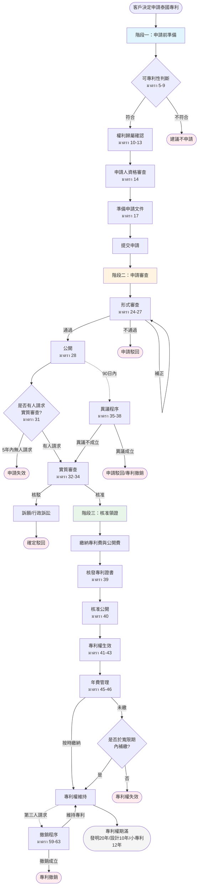

# 泰國專利申請程序 — 標準作業流程（SOP）

> **法規依據**：พระราชบัญญัติสิทธิบัตร พ.ศ. ๒๕๒๒ (Patent Act B.E. 2522, 1979)  
> **最後修訂**：พ.ร.บ. สิทธิบัตร (ฉบับที่ ๓) พ.ศ. ๒๕๔๒ (Amendment No. 3, B.E. 2542, 1999)

---

## 📋 程序架構總覽

```
泰國專利申請完整流程
│
├─ 階段一：申請前準備階段 (Preparation Phase)
│  ├─ 可專利性判斷 (มาตรา 5-9)
│  ├─ 權利歸屬確認 (มาตรา 10-13)
│  ├─ 申請人資格審查 (มาตรา 14)
│  └─ 申請文件準備 (มาตรา 17)
│
├─ 階段二：申請審查階段 (Examination Phase)
│  ├─ 形式審查 (มาตรา 24-27)
│  ├─ 檢索與公開 (มาตรา 28-30)
│  ├─ 實質審查請求 (มาตรา 31)
│  ├─ 實質審查 (มาตรา 32-34)
│  └─ 異議程序 (มาตรา 35-38)
│
└─ 階段三：核准領證階段 (Grant & Maintenance Phase)
   ├─ 專利核准與登記 (มาตรา 39-40)
   ├─ 專利權效力 (มาตรา 36, 41-44)
   ├─ 年費繳納 (มาตรา 45-46)
   └─ 專利撤銷 (มาตรา 59-63)
```

---

# 🅐 SOP-01｜申請前準備階段（Preparation Phase）

## 一、流程名稱

**SOP-01：泰國專利申請建立與遞交流程**  
（Filing of Thai Patent Application）

---

## 二、適用時機

* 客戶決定進行泰國專利申請
* 新案首次提交至泰國智慧財產局（DIP）

---

## 三、可專利性判斷

### 1️⃣ 可專利要件（มาตรา 5）

申請專利之發明必須具備以下三項要件：

#### ✅ 新穎性（Novelty）
**法條**：มาตรา 6  
**定義**：該發明非「已知技術」（Prior Art）

**已知技術包括**：
- 申請日前已在泰國境內使用或公開者（มาตรา 6(1)）
- 申請日前已於文件或出版物中揭露者（不限境內外）（มาตรา 6(2)）
- 已取得專利或小專利者（不限境內外）（มาตรา 6(3)）
- 在境外已申請超過18個月但尚未獲准者（มาตรา 6(4)）
- 已公開之申請案（มาตรา 6(5)）

**新穎性例外（Grace Period）**：มาตรา 6, วรรคสอง  
申請日前12個月內，以下情形之揭露不構成新穎性喪失：
- 因不法行為導致之揭露
- 發明人自行揭露
- 在國際展覽會中展出
- 在官方展覽會中展出

---

#### ✅ 進步性（Inventive Step）
**法條**：มาตรา 7  
**定義**：該發明對於該技術領域具通常知識者而言，非顯而易見

---

#### ✅ 產業利用性（Industrial Applicability）
**法條**：มาตรา 8  
**定義**：該發明可應用於工業、手工藝、農業或商業生產

---

### 2️⃣ 不予專利標的（มาตรา 9）

以下項目不受專利保護：

| 排除項目 | 法條 |
|---------|------|
| 自然存在之微生物及其部分、動物、植物或動植物萃取物 | มาตรา 9(1) |
| 科學與數學之規則與理論 | มาตรา 9(2) |
| 電腦程式 | มาตรา 9(3) |
| 人類或動物之診斷、治療或手術方法 | มาตรา 9(4) |
| 違反公序良俗、公共衛生或人民福祉者 | มาตรา 9(5) |

---

## 四、權利歸屬確認

### 3️⃣ 申請權人（มาตรา 10）

**原則**：發明人有權申請專利  
**可轉讓性**：專利申請權得讓與及繼承  
**書面要件**：讓與須以書面為之，並經讓與人與受讓人簽名

---

### 4️⃣ 職務發明（มาตรา 11-13）

#### 🔹 受僱關係（มาตรา 11）

**申請權歸屬雇主之情形**：
1. 依僱傭契約所為之發明
2. 契約目的為進行發明之工作
3. 利用雇主之方法、統計或報告完成之發明（即使契約未涉及發明工作）

**例外**：契約另有約定者，從其約定

---

#### 🔹 特別報酬請求權（มาตรา 12）

**要件**：
- 雇主因該發明獲得利益或使用該發明
- 受僱人得請求「特別報酬」（非一般薪資）

**程序**：
- 向局長（อธิบดี）提出申請
- 局長考量因素：薪資水準、發明重要性、雇主所獲利益、其他規定條件

**保護**：特別報酬請求權不得以僱傭契約排除

---

#### 🔹 公務員發明（มาตรา 13）

公務員、國營事業或政府機關員工之職務發明，準用第12條規定  
**例外**：該機關內部規定另有規定者，從其規定

---

## 五、申請人資格（มาตรา 14）

申請人須具備以下資格之一：

| 資格類別 | 說明 | 法條 |
|---------|------|------|
| 泰國國民 | 自然人或法人總部設於泰國 | มาตรา 14(1) |
| 公約成員國國民 | 國際條約或協定成員國國民 | มาตรา 14(2) |
| 互惠國國民 | 允許泰國國民在該國申請專利之國家 | มาตรา 14(3) |
| 居住或營業地 | 住所或實際從事工商業於泰國或公約成員國 | มาตรา 14(4) |

---

## 六、共同發明處理（มาตรา 15-16）

### 5️⃣ 共同發明人（มาตรา 15）

**原則**：多人共同完成發明者，共同申請專利

**例外處理**：
- 共同發明人之一不同意共同申請
- 無法聯繫
- 無申請資格

→ 其他發明人得以自己名義單獨申請

**加入程序**：未參與申請之共同發明人，得於核准前申請加入共同申請人

---

### 6️⃣ 相同發明競爭（มาตรา 16）

**原則**：先申請原則（First-to-File）  
不同人獨立完成相同發明，以先提出申請者為準

**同日申請**：
- 應協商決定單獨或共同申請
- 局長設定期限內未達成協議
- 須於期限屆滿後90日內向法院提起訴訟
- 未起訴者，視為拋棄申請

---

## 七、申請文件製備（มาตรา 17）

### 7️⃣ 必備文件與內容

依部級規章（กฎกระทรวง）規定之程序與方式提出申請

#### 📄 申請書必載事項（มาตรา 17, วรรคสอง）

| 項目 | 內容要求 | 法條 |
|------|---------|------|
| (1) 名稱 | 表彰發明之名稱 | มาตรา 17(1) |
| (2) 性質與目的 | 發明之特性與用途 | มาตรา 17(2) |
| (3) 說明書 | 完整、精確、清楚之詳細說明，使該技術領域具通常知識者能實施；須記載發明人已知最佳實施方式 | มาตรา 17(3) |
| (4) 申請專利範圍 | 明確界定請求保護範圍 | มาตรา 17(4) |
| (5) 其他事項 | 依部級規章規定之事項 | มาตรา 17(5) |

---

#### 🌐 國際協定適用（มาตรา 17, วรรคสาม）

泰國加入之國際條約或合作協定所規定之申請格式，視為符合本法申請要件

---

### 8️⃣ 單一性要求（มาตรา 18）

**原則**：一申請案限一項發明

**例外**：多項發明具有關聯性，可視為單一發明概念者，得於同一申請案中申請

---

### 9️⃣ 優先權主張

#### 🔹 國內優先權（มาตรา 19）

**要件**：
- 在泰國官方或經官方許可之公開展覽會展出
- 展覽開幕日起12個月內提出申請

**效果**：以展覽開幕日為申請日

---

#### 🔹 國際優先權（มาตรา 19 ทวิ）

**要件**（符合มาตรา 14資格者）：
- 已於境外提出首次申請
- 於首次申請日起12個月內在泰國提出申請

**效果**：得請求以境外首次申請日作為泰國申請日

---

### 🔟 申請文件修正（มาตรา 20）

**允許範圍**：依部級規章規定之程序與方式得修正申請案

**限制**：修正不得增加發明之實質內容

---

## 八、保密義務（มาตรา 21-23）

### 申請前保密（มาตรา 21）

**適用對象**：負責專利申請業務之官員

**禁止行為**：公開前不得：
- 揭露發明詳細內容
- 允許他人以任何方式檢視或複製

**例外**：取得申請人書面同意

---

### 第三人保密義務（มาตรา 22）

**適用對象**：知悉已提出專利申請之人

**禁止行為**：公開前不得：
- 以任何方式揭露發明詳細內容
- 為可能損害申請人之行為

**例外**：取得申請人書面同意

---

### 國家安全保密（มาตรา 23）

**局長權限**：
- 認定發明涉及國家安全需保密時
- 得命令保密發明內容
- 直到另行指示為止

**效力**：所有人（包括申請人）不得揭露  
**例外**：依法有權揭露者

---

## 九、官方回饋與分流

### ✔ 形式審查通過

→ 取得申請日  
→ 進入 **SOP-02：實體審查階段**

---

### ❌ 形式審查不通過

→ 補正通知（依มาตรา 24-27相關規定）  
→ 期限內未補正：申請案駁回或視為撤回

---

# 🅑 SOP-02｜申請審查階段（Examination Phase）

## 一、流程名稱

**SOP-02：泰國專利實體審查與答辯流程**  
（Substantive Examination Procedure）

---

## 二、適用時機

* 形式審查通過，取得申請日
* 申請案已公開

---

## 三、作業步驟

### 1️⃣ 形式審查（มาตรา 24-27）

#### 📋 申請日認定（มาตรา 24）

**申請日取得要件**（同時具備以下文件）：
1. 發明名稱
2. 申請人姓名與地址
3. 發明說明書
4. 申請專利範圍

**瑕疵補正**：
- 官員通知申請人於指定期限內補正
- 補正後：以首次提交日為申請日
- 未補正：以補正完成日為申請日

---

#### 🔍 形式審查內容（มาตรา 25-27）

**審查項目**：
- 申請人資格（มาตรา 14）
- 單一性（มาตรา 18）
- 申請書格式與內容（มาตรา 17）
- 費用繳納

**不合格處理**（มาตรา 26）：
- 通知申請人於90日內補正
- 補正通知應載明：瑕疵事項、補正期限
- 期限屆滿未補正：視為未提出申請

**複審（มาตรา 27）**：
- 申請人對補正通知不服
- 得於30日內請求局長複審
- 局長應於60日內作出決定

---

### 2️⃣ 檢索與公開（มาตรา 28-30）

#### 📰 公開程序（มาตรา 28）

**公開時點**：形式審查通過後

**公開內容**：
- 發明名稱
- 申請人姓名
- 發明人姓名
- 申請日（含優先權日）
- 申請案號
- 申請專利範圍摘要

**公開效力**（มาตรา 30）：
- 公開後即開放公眾閱覽
- 任何人得申請檢索
- 任何人得提出意見書

---

#### 🔎 檢索請求（มาตรา 29）

**請求權人**：任何人（包括申請人、第三人）

**檢索範圍**：
- 新穎性檢索
- 進步性檢索
- 產業利用性檢索

**檢索報告**：
- 官方出具檢索結果
- 列舉相關先前技術文獻

---

### 3️⃣ 實質審查請求（มาตรา 31）

#### ⏰ 請求期限

**起算**：公開日

**期限**：公開日起5年內

**請求權人**：
- 申請人
- 任何第三人

**費用**：依規定繳納實質審查費

---

#### ❌ 未請求效果

公開後5年內無人請求實質審查 → **申請案失效**

---

### 4️⃣ 實質審查（มาตรา 32-34）

#### 🔬 審查基準（มาตรา 32）

審查員審查以下事項：

| 審查項目 | 法條依據 |
|---------|---------|
| 可專利標的 | มาตรา 9 |
| 新穎性 | มาตรา 6 |
| 進步性 | มาตรา 7 |
| 產業利用性 | มาตรา 8 |
| 說明書充分揭露 | มาตรา 17(3) |
| 申請專利範圍明確性 | มาตรา 17(4) |

---

#### 📝 審查意見通知（มาตรา 33）

**審查員權限**：
- 發出核駁理由通知
- 要求申請人於指定期限內答辯或修正
- 期限通常為90日，得申請延長

**申請人回應**：
- 提出答辯理由書
- 修正申請專利範圍
- 修正說明書（不得增加實質內容）

---

#### ✅ 核准決定（มาตรา 33）

**要件**：審查員認定符合所有專利要件

**程序**：
- 作成核准決定
- 通知申請人繳納專利費與公開費
- 申請人於期限內繳費

→ 進入 **SOP-03：核准領證階段**

---

#### ❌ 核駁決定（มาตรา 34）

**要件**：審查員認定不符專利要件，且申請人無法克服

**程序**：
- 作成核駁決定
- 載明核駁理由
- 通知申請人

**救濟**：
- 申請人得於60日內向專利委員會（คณะกรรมการสิทธิบัตร）提起訴願
- 訴願決定不服，得向法院提起行政訴訟

---

### 5️⃣ 異議程序（มาตรา 35-38）

#### 📢 異議提出（มาตรา 35）

**期限**：公開日起90日內

**異議人資格**：任何人

**異議理由**（มาตรา 36）：
1. 違反มาตรา 5-9（可專利性要件）
2. 發明已公開揭露（มาตรา 6）
3. 申請人非真正權利人（มาตรา 10-13）
4. 說明書未充分揭露（มาตรา 17(3)）
5. 申請專利範圍不明確（มาตรา 17(4)）
6. 修正超出原申請範圍（มาตรา 20）

---

#### 🔄 異議審理（มาตรา 37）

**程序**：
1. 官員通知申請人異議內容
2. 申請人於60日內提出答辯
3. 官員審理異議與答辯
4. 必要時召開聽證會
5. 作出決定

**決定類型**：
- 異議成立 → 駁回申請或撤銷專利
- 異議不成立 → 維持申請或專利

---

#### ⚖ 救濟（มาตรา 38）

異議決定不服 → 向專利委員會提起訴願 → 向法院提起行政訴訟

---

## 四、官方回饋與分流

### ✔ 實質審查通過

→ 作成**核准決定**（มาตรา 33）  
→ 繳納專利費與公開費  
→ 進入 **SOP-03：核准領證階段**

---

### ❌ 實質審查未通過

→ 作成**核駁決定**（มาตรา 34）  
→ 提起訴願或行政訴訟

---

### ⚠ 異議成立

→ **駁回申請**或**撤銷專利**（มาตรา 37）  
→ 提起訴願或行政訴訟

---

# 🅒 SOP-03｜核准領證階段（Grant & Maintenance Phase）

## 一、流程名稱

**SOP-03：泰國專利核准、公開與維護管理流程**  
（Grant, Publication & Maintenance Procedure）

---

## 二、適用時機

* 實質審查通過
* 接獲核准通知

---

## 三、作業步驟

### 1️⃣ 專利核准與登記（มาตรา 39-40）

#### 📜 專利證書核發（มาตรา 39）

**程序**：
1. 申請人收到核准通知
2. 於期限內繳納專利費與公開費
3. 局長核發專利證書

**專利證書記載事項**：
- 專利號數
- 專利名稱
- 專利權人姓名與地址
- 發明人姓名
- 申請日與核准日
- 優先權日（如有）
- 專利權期限

---

#### 📰 核准公開（มาตรา 40）

**公開內容**：
- 專利號數
- 專利名稱
- 專利權人
- 核准日
- 申請專利範圍

**公開效力**：
- 專利權自公開日生效
- 公眾得查閱完整專利說明書

---

### 2️⃣ 專利權效力（มาตรา 36, 41-44）

#### 🛡 專利權範圍（มาตรา 36）

**保護範圍**：以申請專利範圍為準

**解釋原則**：
- 參酌說明書與圖式
- 以申請專利範圍文字為主
- 說明書與圖式為輔助解釋

---

#### ⚖ 專利權內容（มาตรา 41-42）

**物的發明（มาตรา 41）**：
專利權人專有以下權利：
- 製造
- 使用
- 販賣
- 持有以販賣為目的
- 進口

**方法發明（มาตรา 42）**：
專利權人專有以下權利：
- 使用該方法
- 使用、販賣、持有以販賣為目的或進口該方法直接製成之物品

---

#### ⏱ 專利權期限（มาตรา 43）

**發明專利**：自申請日起20年

**設計專利**：自申請日起10年

**小專利**：自申請日起6年，得續展2次，每次3年，最長12年

---

#### 🚫 專利權限制（มาตรา 44）

專利權效力不及於以下行為：
1. 非營利之研究或實驗
2. 專利權用盡（首次販賣後之後續流通）
3. 過境運輸
4. 依藥事法等法規規定之行為
5. 專利申請日前已在泰國實施或已完成實施準備者（先用權）

---

### 3️⃣ 年費繳納與管理（มาตรา 45-46）

#### 💰 年費制度（มาตรา 45）

**繳納時點**：
- 第1-4年：免繳
- 第5年起：每年繳納

**繳納期限**：
- 原則：每年屆滿前繳納次年年費
- 得於期限屆滿後6個月內補繳（加倍繳納）

**未繳效果**（มาตรา 46）：
- 寬限期屆滿仍未繳納 → 專利權失效
- 失效日：應繳年費之年度開始日

---

#### 🔄 專利權恢復（มาตรา 46, วรรคสอง）

**要件**：
- 因不可歸責事由未繳年費
- 失效後1年內申請恢復

**程序**：
- 補繳年費
- 繳納恢復費
- 檢附不可歸責事由證明

---

### 4️⃣ 專利權變更登記

#### 🔀 專利權讓與（มาตรา 40）

**生效要件**：
- 讓與契約書面化
- 向局長申請登記
- 繳納登記費

**未登記效果**：不得對抗第三人

---

#### 📝 授權登記

**授權類型**：
- 專屬授權
- 非專屬授權

**登記效果**：
- 登記後得對抗第三人
- 未登記僅具債權效力

---

### 5️⃣ 專利撤銷（มาตรา 59-63）

#### ⚠ 撤銷事由（มาตรา 59）

任何人得以下列理由請求撤銷專利：

| 撤銷理由 | 法條 |
|---------|------|
| 違反可專利性要件 | มาตรา 5-9 |
| 申請人非真正權利人 | มาตรา 10-13 |
| 說明書未充分揭露 | มาตรา 17(3) |
| 申請專利範圍超出原申請範圍 | มาตรา 20 |
| 專利權人違反使用義務 | มาตรา 46-52（強制授權相關） |

---

#### 📋 撤銷程序（มาตรา 60-62）

**提起**：
1. 向局長提出撤銷申請書
2. 載明撤銷理由與證據
3. 繳納規費

**審理**：
1. 局長通知專利權人答辯（60日）
2. 審理撤銷理由與答辯
3. 必要時召開聽證會
4. 作出撤銷或維持決定

**撤銷效果**（มาตรา 62）：
- 全部撤銷：專利權視為自始不存在
- 部分撤銷：申請專利範圍限縮

**救濟**（มาตรา 63）：
- 向專利委員會提起訴願
- 向法院提起行政訴訟

---

## 四、後續程序分流

### ▶ 第三人提起撤銷

→ **專利撤銷程序**（มาตรา 59-63）

---

### ▶ 專利侵權訴訟

→ 向智慧財產與國際貿易法院提起民事或刑事訴訟

---

### ▶ 強制授權請求

→ 依มาตรา 46-52規定程序處理

---

### ▶ 對官方決定不服

→ 向專利委員會提起訴願 → 向法院提起行政訴訟

---

# 📊 三階段流程關係圖



---

# 📌 重要期限總覽

| 事項 | 期限 | 法條 | 備註 |
|------|------|------|------|
| 新穎性優惠期 | 申請日前12個月 | มาตรา 6, วรรคสอง | 特定情形之揭露不喪失新穎性 |
| 國際優先權 | 境外首次申請日起12個月 | มาตรา 19 ทวิ | 需符合มาตรา 14資格 |
| 形式審查補正 | 通知日起90日 | มาตรา 26 | 未補正視為未申請 |
| 補正複審請求 | 通知日起30日 | มาตรา 27 | 向局長請求 |
| 異議提出 | 公開日起90日 | มาตรา 35 | 任何人得提出 |
| 異議答辯 | 通知日起60日 | มาตรา 37 | 專利權人或申請人答辯 |
| 實質審查請求 | 公開日起5年 | มาตรา 31 | 未請求則申請失效 |
| 核駁訴願 | 核駁決定日起60日 | มาตรา 34 | 向專利委員會 |
| 年費繳納 | 每年屆滿前 | มาตรา 45 | 第5年起繳納 |
| 年費寬限期 | 期限屆滿後6個月 | มาตรา 45 | 加倍繳納 |
| 專利權恢復 | 失效後1年 | มาตรา 46 | 需證明不可歸責 |

---

# 🔗 相關規費表

| 項目 | 金額（泰銖） | 備註 |
|------|-------------|------|
| 申請費（專利或小專利） | 1,000 | 每件 |
| 申請費（設計專利，10件以上同時申請） | 10,000 | 總計 |
| 公開費 | 500 | - |
| 檢索請求費 | 500 | 每件 |
| 異議費 | 1,000 | 每件 |
| 專利證書費 | 1,000 | 每件 |
| 年費（發明專利） | 依年度遞增 | 第5年2,000起至第20年80,000 |
| 年費（設計專利） | 依年度遞增 | 第5年1,000起至第10年6,000 |
| 年費（小專利） | 依年度遞增 | 第5年2,000起，最高6,000 |
| 訴願費 | 1,000 | 每件 |

**註**：費用依 พ.ร.บ. สิทธิบัตร (ฉบับที่ ๓) พ.ศ. ๒๕๔๒ มาตรา ๔๒ 修正

---

# 📚 附註

1. **法規全稱**：
   - พระราชบัญญัติสิทธิบัตร พ.ศ. ๒๕๒๒ = Patent Act B.E. 2522 (1979)
   - 最後修正：พ.ร.บ. สิทธิบัตร (ฉบับที่ ๓) พ.ศ. ๒๕๔๒ = Patent Act (Amendment No. 3) B.E. 2542 (1999)

2. **主管機關**：
   - 泰國智慧財產局（Department of Intellectual Property, DIP）
   - 隸屬商務部（Ministry of Commerce）

3. **專利類型**：
   - สิทธิบัตร（Patent）= 發明專利
   - อนุสิทธิบัตร（Petty Patent）= 小專利
   - แบบผลิตภัณฑ์（Design Patent）= 設計專利

4. **本SOP編製說明**：
   - 依據泰國專利法完整條文編製
   - 僅翻譯程序性規定，實體內容保留泰文法條編號供參
   - 建議實際申請時諮詢泰國當地專利代理人
